# Part2-AXI-GPIO

本章將介紹如何使用 AXI GPIO (General Purpose Input/Output) IP，透過軟體程式控制板子上的 Switch 與 LED，並進一步將資料寫入 GPIO 作為控制訊號，驅動硬體電路（如 Adder/Subtracter）。

## Purpose  
透過

## Part 2.1 Vivado Block Design

1.  Create a new Vivado Project  

2.  Create a new Block Design

3.  先加入 `ZYNQ7_Processing System` 並點選上方 `Run Block Automation`  

    

4.  對 `ZYNQ7 Processing System` 點兩下進入設定，點選左側 `Peripheral I/O pins`，將全部都關掉後，打開`UART0`就好  

    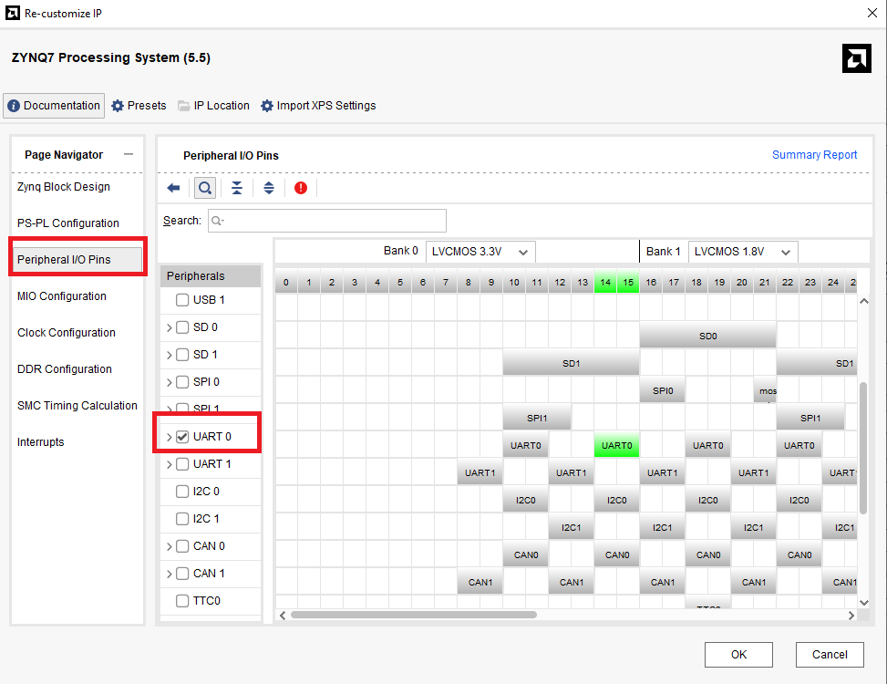

5.  再加入`六個 GPIO`、`Adder/Subtracter`、`Constant`  

    

6.  點選上方綠色橫幅 `Run Connection Automation`，並全部打勾按 `OK`  

    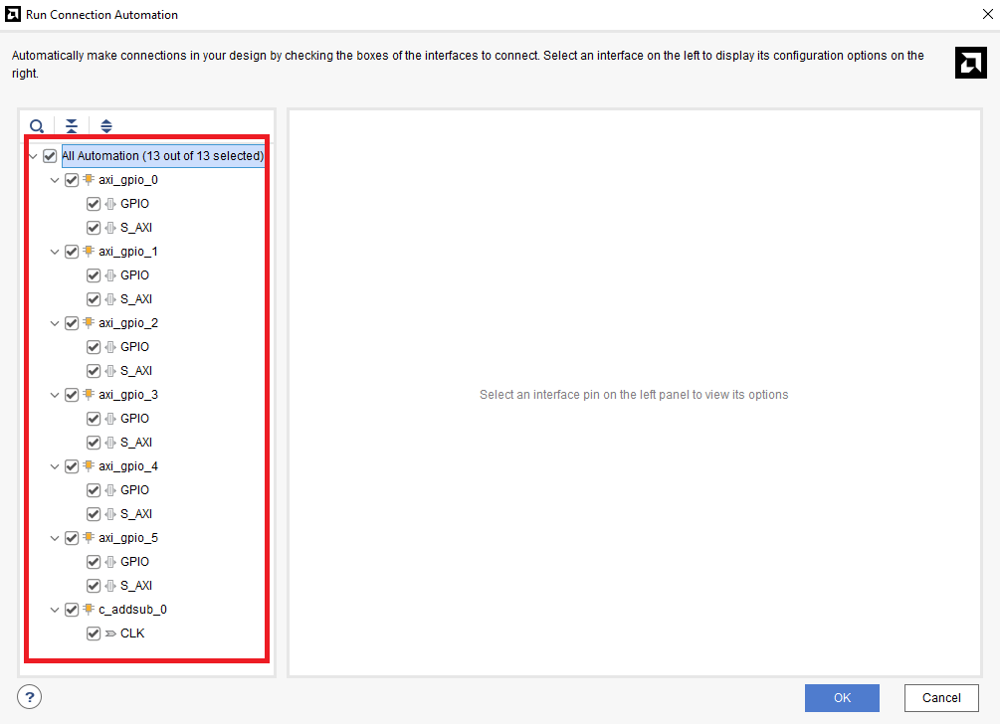  

    自動連線完成後，點選 `Regenerate Layout` ，讓 Vivado 幫你自動排版  
    
    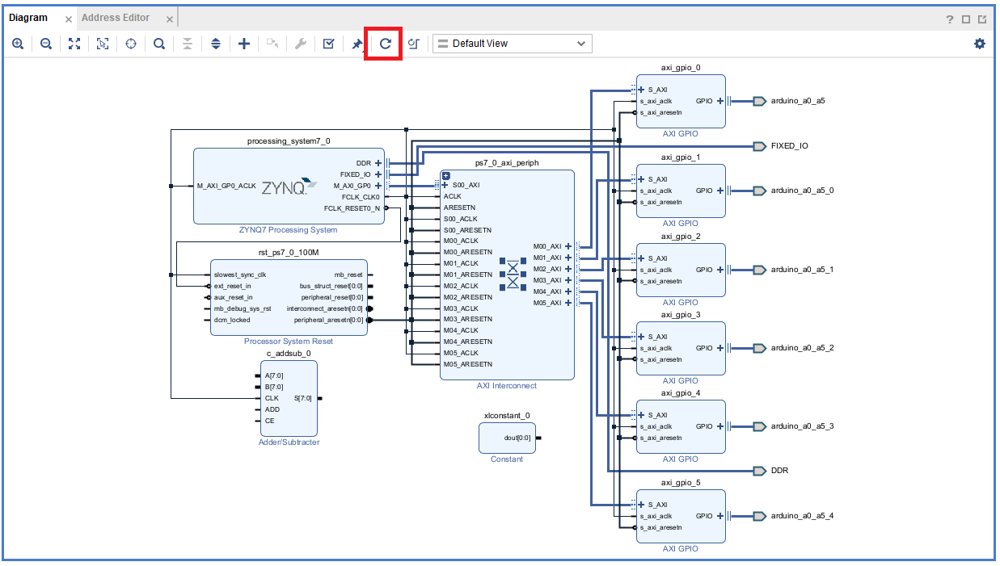  

7.  移除所有 `GPIO` 的 Port

    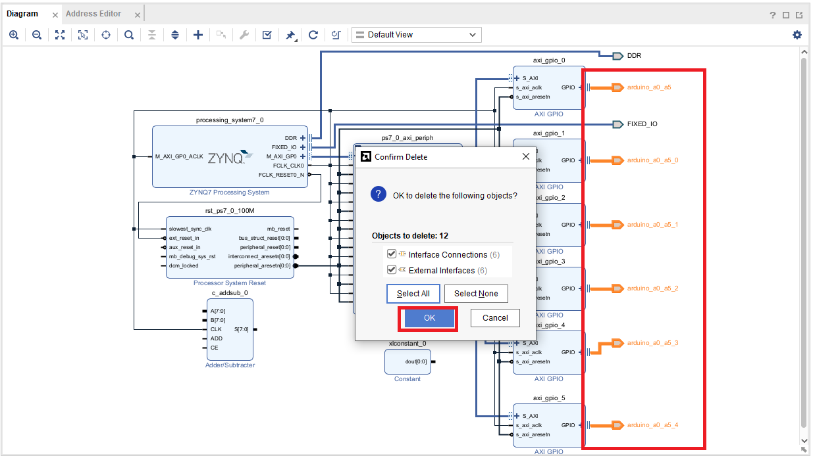
    

8.  接下來要依序對各個 GPIO 做不同的設定，需要對清楚名稱，若沒有照順序則需要修改 C code  

    -   **axi_gpio_0**:  
          
    
    -   **axi_gpio_1**:  
          

    -   **axi_gpio_2**:  
        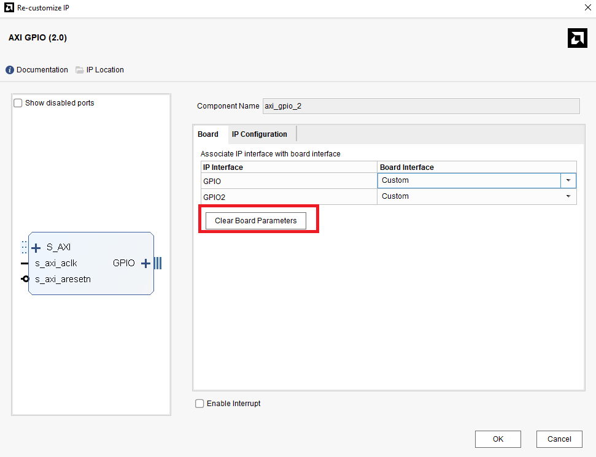  
          
        
    -   **axi_gpio_3**:  
        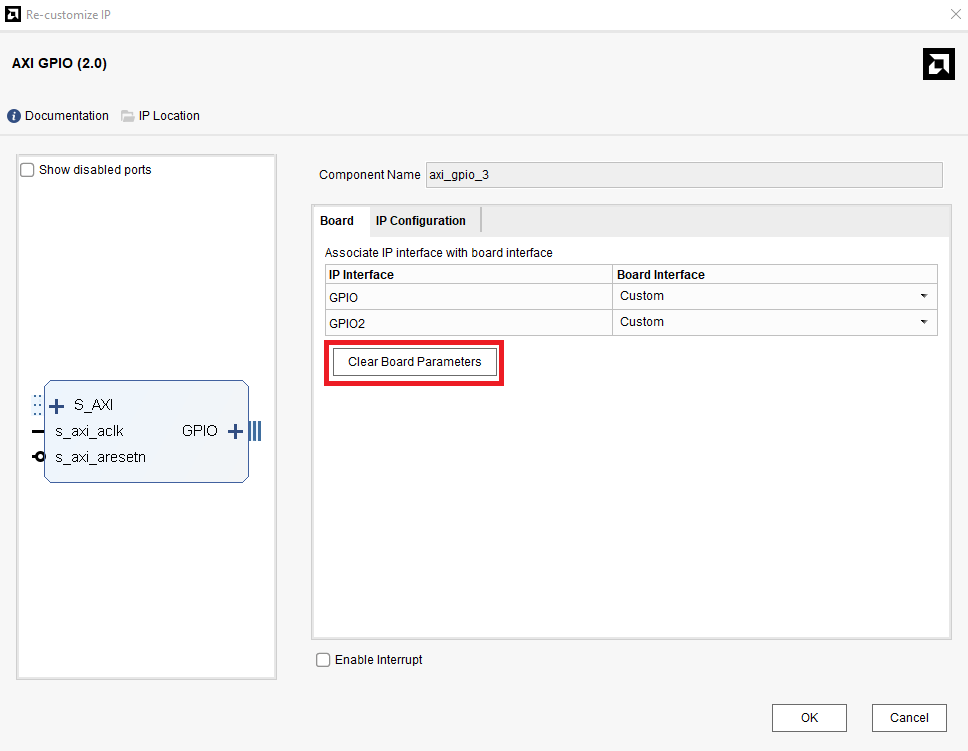  
            
    
    -   **axi_gpio_4**:  
          
          

    -   **axi_gpio_5**:  
        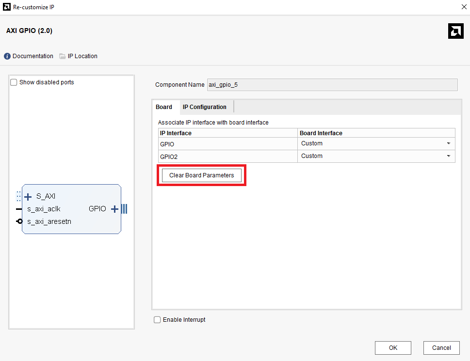  
          

9.  調整 `Constant` 設定  

    

10.  調整 `Adder/Subtracter` 設定
    

>📌 Fabric / DSP ?  
>在設定`Adder/Subtracter`的設定時可以看到最上面有一個 `implement using` 的選項，在 FPGA 上面，運算邏輯通常會透過 `LUT` 和 `DSP` 的方式下去實作。  
>
>Fabric：使用 FPGA 中的 Lookup Table (LUT) 與邏輯閘來實現加減法邏輯。  
>-   適合位元數較少（如 8 或 16-bit）的基本加減法運算  
>-   不會占用 DSP 資源，適合小型邏輯  
>
>DSP：使用 FPGA 內建的 DSP Slice，即專用的數位訊號處理器資源。  
>-  適合處理高位元運算（如 32-bit 加法、乘法、MAC）  
>-  高效能、高吞吐，常用於影像處理、機器學習中的 `MAC` 運算  
>
>📌 What's MAC operation?  
>MAC（Multiply-Accumulate）指的是「乘加運算」，例如 `a × b + c`，是數位濾波器、CNN 神經網路等運算核心，DSP Slice 專門針對此類運算設計。

11. 將 `axi_gpio_2`、`axi_gpio_3`、`axi_gpio_4`、`axi_gpio_5`、`Adder/Subtracter`、`Constant`，依照下方圖的方式做連接  

    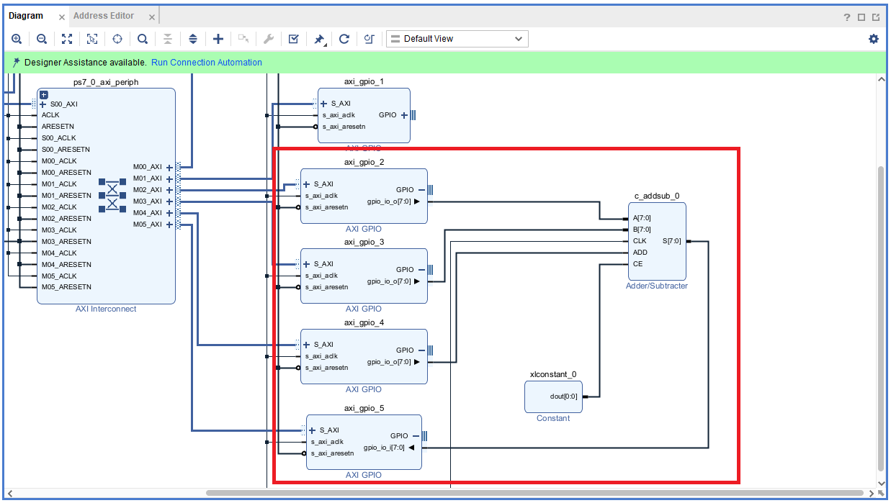  

12. 連接完後點選上方 `Run Connection Automation`，並全部打勾   

    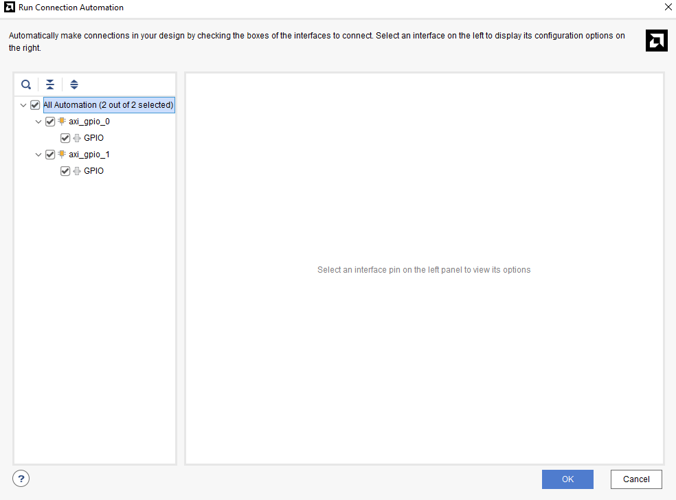  

13. 最後點選 `Validation` 和 `Regenerate Layout`，看看有沒有錯誤  

    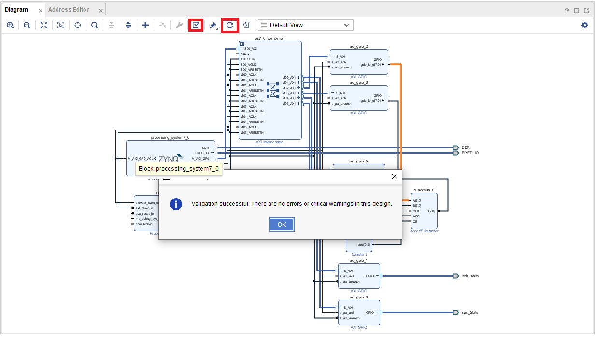

14. 完整電路  

    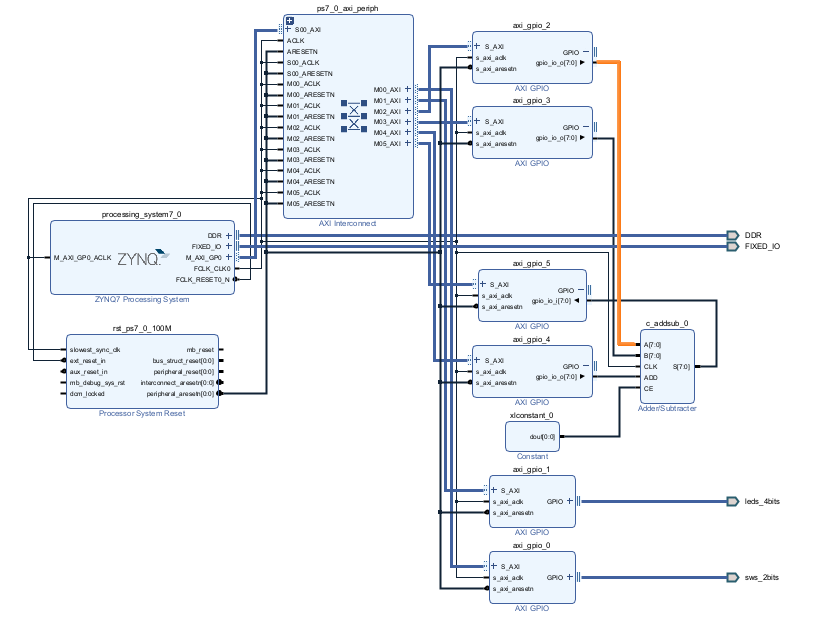  

15. Create HDL Wrapper  

16. Generate Bitstream  

17. `File -> Export -> Export Hardware`

    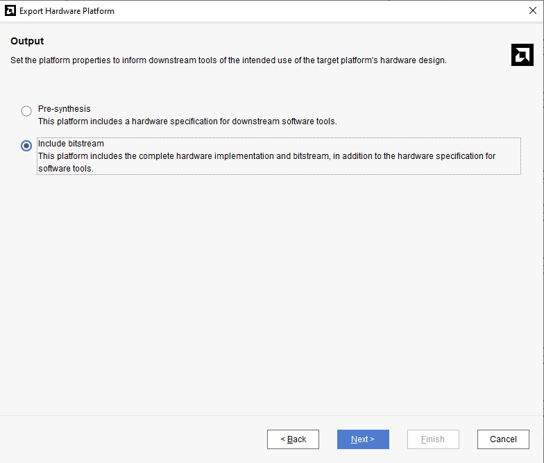

18. 這樣就完成 Vivado 端的電路設計部分，再來要去 Vitis 做軟體設計

## Part 2.2 Vitis Project

1.  照 `Part1` 的方式創立一個 Vitis Project  

2.  使用 Part2.1 產生的 `.xsa` 檔案，創建 `Platform Component`  

3.  一樣使用 `Example Design` 裡面的 `Hello_World` 作為初始的 `Application Project`

    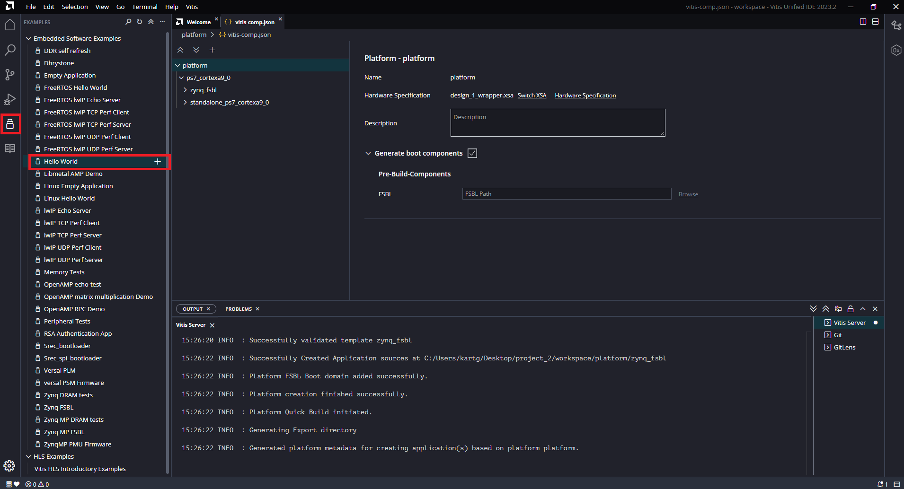  

4.  將 `Application Project` 內的 `main.c` 替換成該次Lab裡面的`src/main.c`  

    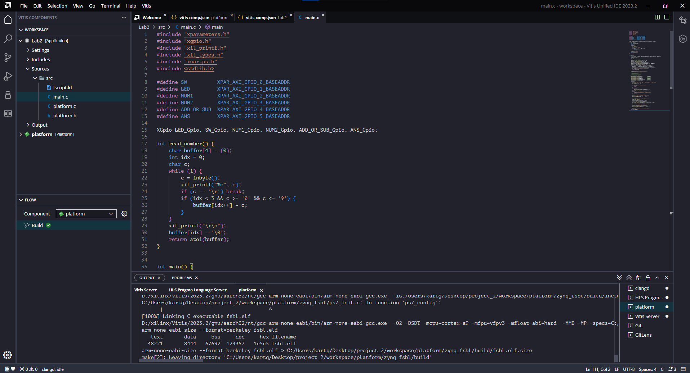  

5.  先 `build platform`

6.  再 `build application`

7.  連接上 PYNQ 板

8.  打開 `MobaXterm` Serial 方式連接上 PYNQ

9.  點選`Run`

    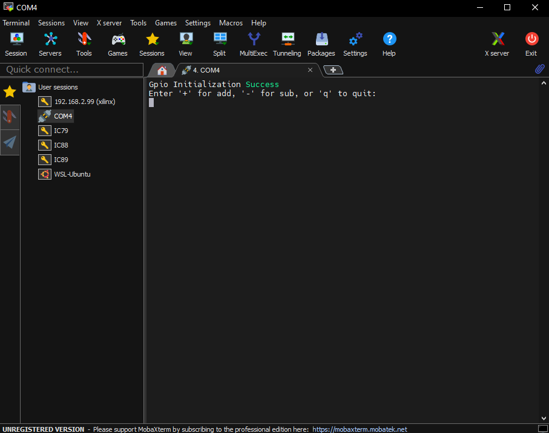

10. 此時你就可以輸入符號去做加減法了，並且每次輸入完會去讀取板子上的 Switch，並將 Switch 的數值透過二進制方式顯示在 LED 上面去

    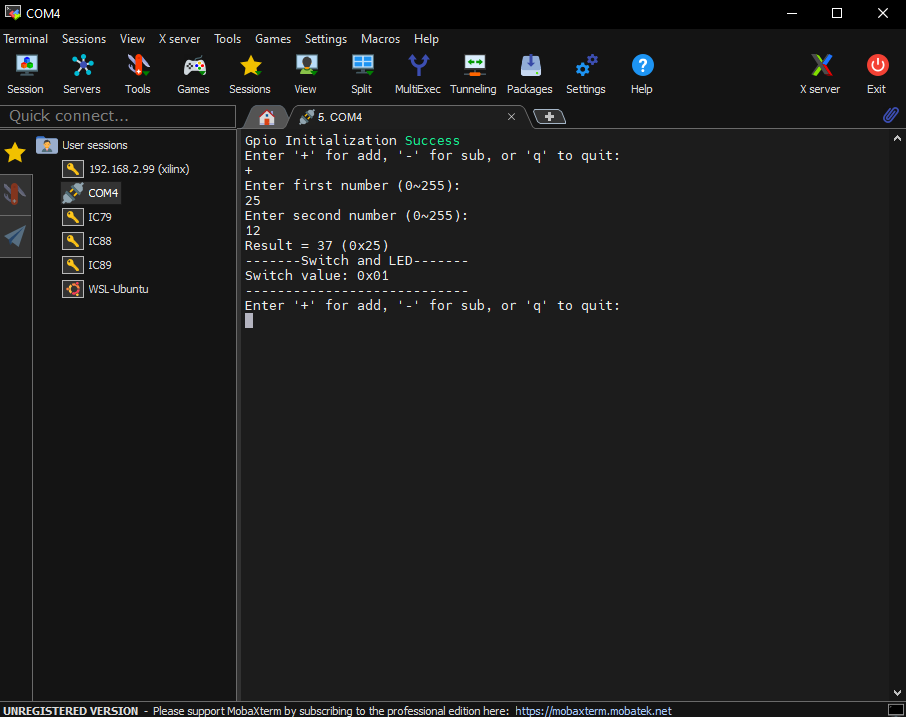  

## Part 2.3 Run & Result

當執行程式後，使用者可以透過 UART 輸入操作指令與數字，進行加法或減法的運算，同時觀察輸出結果與 LED 顯示：

-   透過 UART 輸入 '+' 或 '-'：決定此次要進行加法或減法。

-   輸入第一與第二個操作數（0~255）：分別寫入至 AXI GPIO，作為電路的輸入資料。

-   由 Adder/Subtracter 模組計算結果：將結果透過 GPIO 回傳到電腦顯示。

-   同時可使用 Switch 切換不同狀態，並透過 LED 實時顯示對應的二進位值。