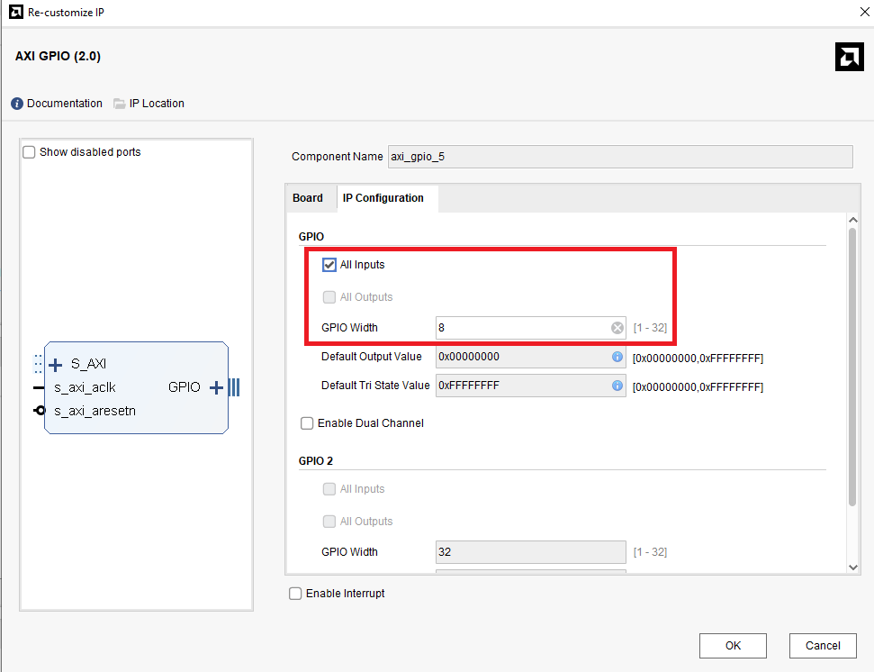

# Part2-AXI-GPIO

本章將介紹如何使用 AXI GPIO (General Purpose Input/Output) IP，透過軟體程式控制板子上的 Switch 與 LED，並進一步將資料寫入 GPIO 作為控制訊號，驅動硬體電路（如 Adder/Subtracter）。

## Purpose  
透過

## Part 2.1 Vivado Block Design

1.  Create a new Vivado Project  

2.  Create a new Block Design

3.  先加入 `ZYNQ7_Processing System` 並點選上方 `Run Block Automation`  

    

4.  再加入`六個 GPIO`、`Adder/Subtracter`、`Constant`  

    

5.  接下來要依序對各個 GPIO 做不同的設定，需要對清楚名稱，若沒有照順序則需要修改 C code  
    -   **axi_gpio_0**:    
    -   **axi_gpio_1**:    
    -   **axi_gpio_2**:    
    -   **axi_gpio_3**:    
    -   **axi_gpio_4**:    
    -   **axi_gpio_5**:    

6.  調整 `Constant` 設定  

    

7.  調整 `Adder/Subtracter` 設定

    

    >📌 Fabric / DSP ?  
    >在設定`Adder/Subtracter`的設定時可以看到最上面有一個 `implement using` 的選項，在 FPGA 上面，運算邏輯通常會透過 `LUT` 和 `DSP` 的方式下去實作。  
    >
    >Fabric：使用 FPGA 中的 Lookup Table (LUT) 與邏輯閘來實現加減法邏輯。  
    >-   適合位元數較少（如 8 或 16-bit）的基本加減法運算  
    >-   不會占用 DSP 資源，適合小型邏輯  
    >
    >DSP：使用 FPGA 內建的 DSP Slice，即專用的數位訊號處理器資源。  
    >-  適合處理高位元運算（如 32-bit 加法、乘法、MAC）  
    >-  高效能、高吞吐，常用於影像處理、機器學習中的 `MAC` 運算  
    >
    >📌 What's MAC operation?  
    >MAC（Multiply-Accumulate）指的是「乘加運算」，例如 `a × b + c`，是數位濾波器、CNN 神經網路等運算核心，DSP Slice 專門針對此類運算設計。