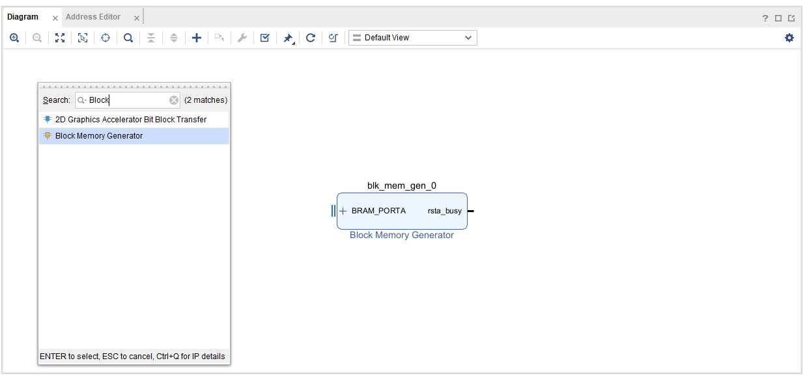
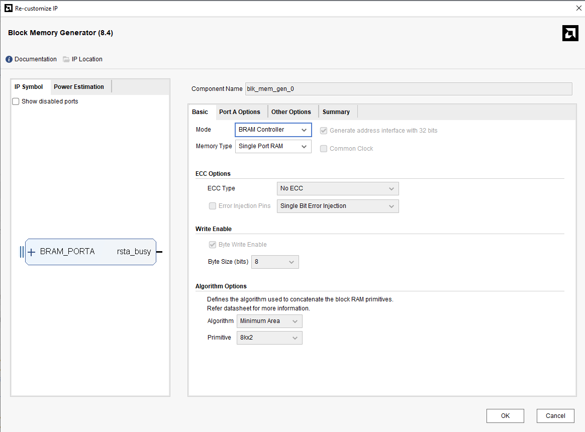

# Part4-BRAM

## What is BRAM?
BRAM（Block RAM）是 FPGA 內建的一種高速記憶體資源，專門用於儲存大量資料，可由`邏輯電路`或 `ZYNQ 的 ARM 核心` 進行讀寫。與外部記憶體（ DDR ）相比，BRAM 擁有更快的存取速度與更低的延遲，適合用於對速度與時序要求較高的應用。

## BRAM in Zynq-7020
Zynq-7000 系列中的 Zynq-7020 SoC，內部 PL（Programmable Logic）中提供：  

| 資源類型 | 數量 | 說明 |
| ------- | -----| --- |
| **36K BRAM blocks** | 140 個 | 每個 Block 為 36Kbits（4.5KB），可配置為Single Port 或 Dual Port 記憶體 |
| **總容量** | 約 630KB | 合計容量為 140 × 4.5KB ≈ 630KB |

## Part 4.1 BRAM Configuration

1.  Create a New Vivado Project and Create a New Block Design

2.  加入 `Block Memory Generator`

    

3.  進入該 IP 設定頁面  

      

| 模式類型 | 說明 |
| ------- | ---- |
| **BRAM Controller** | 搭配 Vivado 中的 AXI BRAM Controller IP 使用，由 AXI 匯流排控制。可透過軟體端對該BRAM進行寫入讀取。 |
| **Standalone** | 提供傳統 RTL 控制介面，如 `clk`, `we`, `addr`, `dout`，適合自己設計 FSM 控制邏輯                 |

## Part 4.2 Standalone BRAM
在進行純硬體設計（Pure RTL or Block Design without Processor）的情境下，BRAM（Block RAM）是我們在 FPGA 裡最常用來儲存資料的元件之一。

## Part 4.3 BRAM Controller

