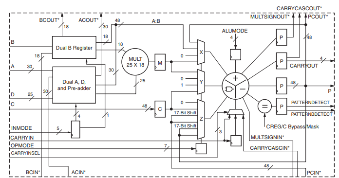
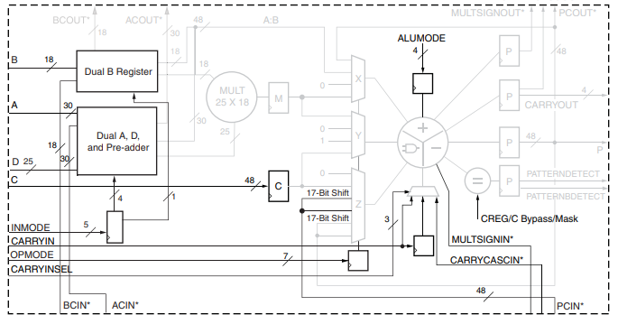
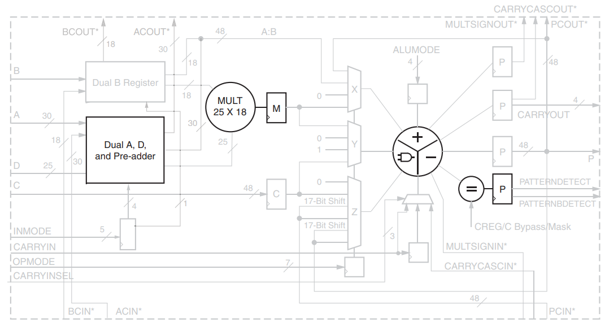

# Part5-DSP

## What is DSP48E1？
`DSP48E1 Slice` 是 `Xilinx 7 系列` FPGA 中專門用於高速數位訊號處理（DSP）的硬體資源。它整合了一組可組態的乘法器、加法器、累加器、邏輯單元與控制邏輯，並可用於建構乘加（MAC）、濾波器、FFT、SIMD 運算等高效能運算模組。

🔧 組成與功能
DSP48E1 Slice 主要包含以下元件：

1. 25×18 乘法器（Multiplier）

        可處理兩數相乘，支援二補數。

2. 48-bit 三輸入加法器 / 累加器（Accumulator / ALU）

        支援加、減、累加、邏輯運算（AND, OR, XOR 等）。

3. Pre-Adder

        D + A 相加，在進入乘法器前做前處理，常用於對稱濾波器。

4. Pattern Detector

        可用於溢位/收斂捨入偵測、自動重設。

5. SIMD 模式（Single Instruction Multiple Data）

        支援 2×24-bit 或 4×12-bit 並行運算。

6. 可程式化管線暫存器

        支援高效能管線設計。

## Input Port

| Port 名稱      | 功能說明                                                                 |
|----------------|-------------------------------------------------------------------------|
| A, B, C        | 數據輸入，A 和 B 是乘法器輸入，C 是第二階段加法器的輸入。                |
| D              | 可用於 Pre-Adder（前加器）或乘法器的輸入，寬度為 25-bit。搭配 A 做 D+A。 |
| INMODE         | 控制 D、A、B 輸入來源與 Pre-Adder 功能（共 5 個 bits），可設定 Pre-Adder 開關、輸入組合與選擇。 |
| CARRYIN        | 外部來的進位輸入，用於加法或累加操作。                                   |
| CARRYINSEL     | 控制 CARRYIN 的來源。               |
| OPMODE         | 控制多工器（MUX）的運算路徑選擇，定義 DSP 的操作模式。                   |
| BCIN / ACIN    | Cascade input，允許將前一個 DSP48E1 的輸出直接輸入下一個。   |
| PCIN           | 前一 DSP slice 的輸出累加器結果輸入。                                    |
| ALUMODE        | 控制 ALU（邏輯/加法）單元的操作模式。                                   |
| CARRYCASCIN    | Cascade 進位輸入，來自前一個 DSP slice 的進位結果。                          |
| MULTSIGNIN     | 乘法結果的符號位輸入，用於多階乘加運算串接。                             |

## Output Ports

| Port 名稱              | 功能說明                                                                                                         |
|------------------------|------------------------------------------------------------------------------------------------------------------|
| P                      | 48-bit 的主輸出，用於乘加、加法、累加等結果輸出。可以經由 PCOUT cascade 至下一個 DSP48E1 的 PCIN，形成資料串接。   |
| PCOUT                  | P 的內部 cascade 輸出，用於將運算結果串接給下一個 DSP48E1。                                                           |
| CARRYOUT[3:0]          | 4-bit carry 輸出，視 SIMD 模式而定代表不同加法區段的進位。只有某些模式下的特定位元才是有效值。      |
| CARRYCASCOUT           | 1-bit cascade 進位輸出，對應於 CARRYOUT，但在硬體上是獨立的，用於多階加法/乘加運算的串接。也可被回饋至 CARRYINSEL。|
| MULTSIGNOUT            | 乘法器結果的 MSB，用於延伸 MACC（乘加累加）操作時傳遞乘號位，搭配 MULTSIGNIN 使用以支援 96-bit 運算。             |
| PATTERNDETECT (PD)     | 用於偵測輸出結果是否符合指定樣式或其補數，並常應用於收斂捨入、飽和控制與自動重設等邏輯功能。                           |
| PATTERNBDETECT (PBD)   | 若 P 結果符合 pattern 的反碼，輸出 High。搭配 mask 使用可忽略部分 bit。                                         |
| OVERFLOW, UNDERFLOW    | 透過 pattern detector 偵測加法/累加運算是否超出特定位元界限。須啟用 P 寄存器時才有效。              |

## Embedded Functions

| 模組功能         | 說明                                                                 | 主要參數/控制信號           | 備註                                                                                      |
|------------------|---------------------------------------------------------------------|-----------------------------|-------------------------------------------------------------------------------------------|
| Pre-Adder        | 位於 A 輸入路徑中的 25-bit 加減器，可實作前加/前減運算              | INMODE, D, A                | - 輸出送入乘法器 - 無飽和保護，建議輸入限制為 24-bit 二補數 - 最多 10 種操作模式 - 可繞過改用 D 直接輸入 |
| Multiplier       | 25-bit × 18-bit 的二補數乘法器，支援乘法部分 cascade                    | 無需額外控制                 | - 輸出 43-bit ×2 partial products（共 86-bit） - 支援 17-bit 右移後的 cascade（MULT-to-MULT 級聯） - 可模擬 unsigned 運算（將 MSB 設為 0） - 輸出可使用 MREG 做 pipeline |
| Adder / Subtracter / Logic Unit | 嵌入式 ALU 支援加、減、與邏輯運算，為三輸入結構         | OPMODE, ALUMODE, CARRYINSEL | - 3 個輸入為 X、Y、CIN（常為 PCIN/CARRY） - 加減控制由 ALUMODE 指定 - OPMODE 控制 X/Y/Z multiplexer 的輸入選擇 - 使用邏輯運算時禁止使用 multiplier |

# Reference

[7 Series DSP48E1 Slice User Guide (UG479)](https://docs.amd.com/v/u/en-US/ug479_7Series_DSP48E1)