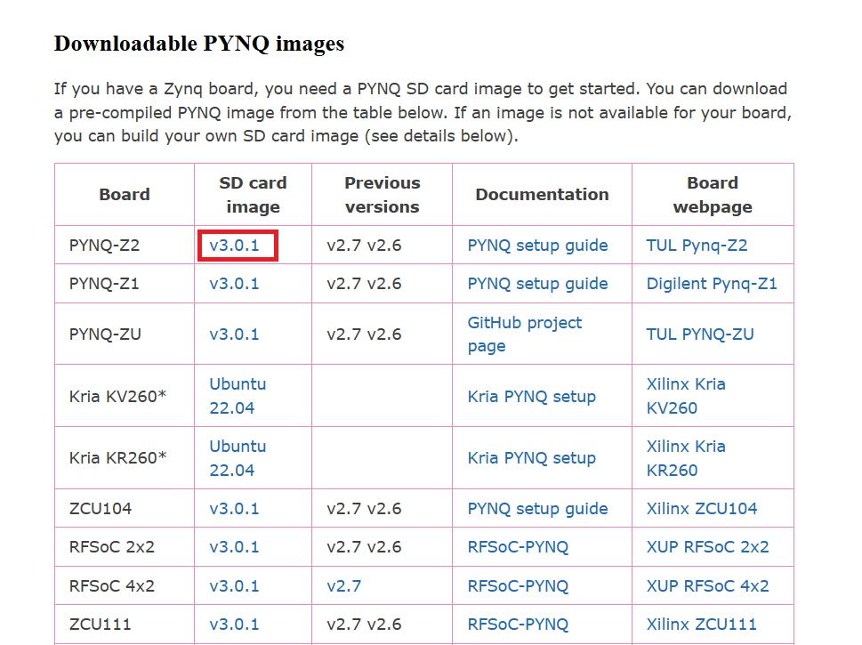
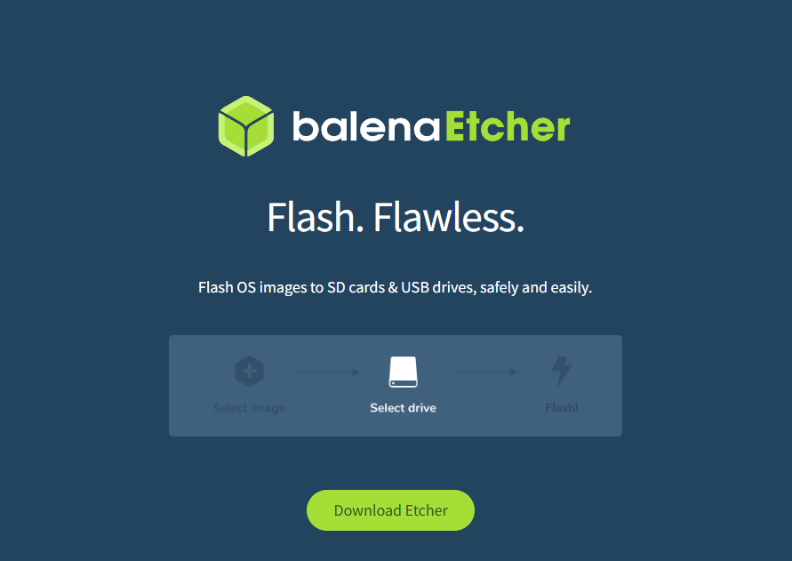
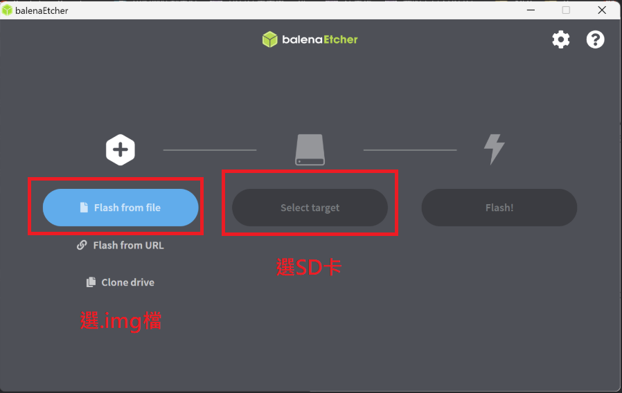
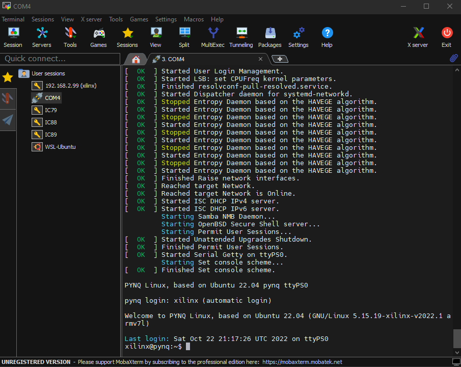
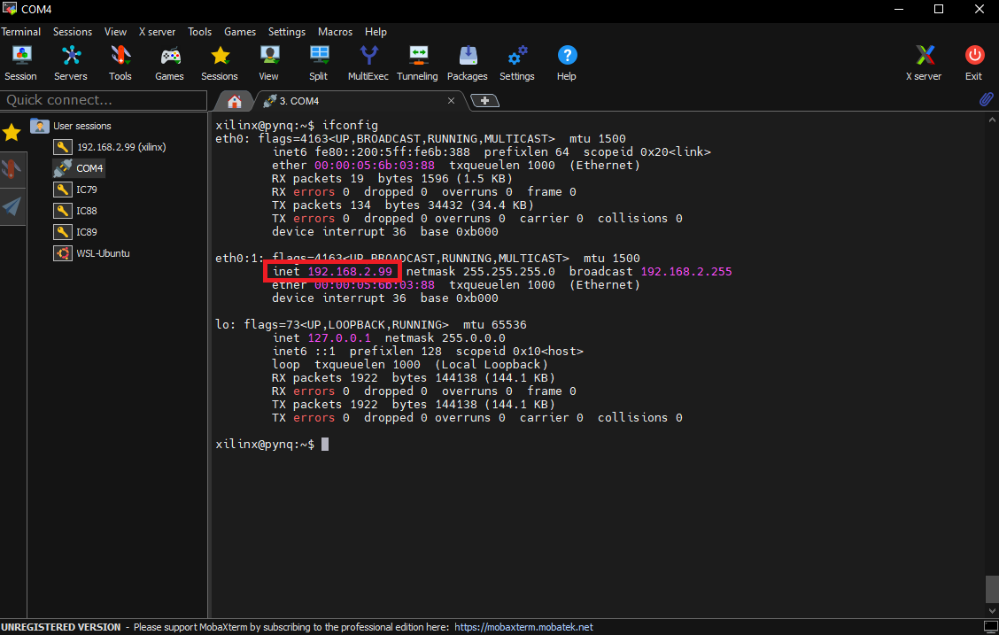
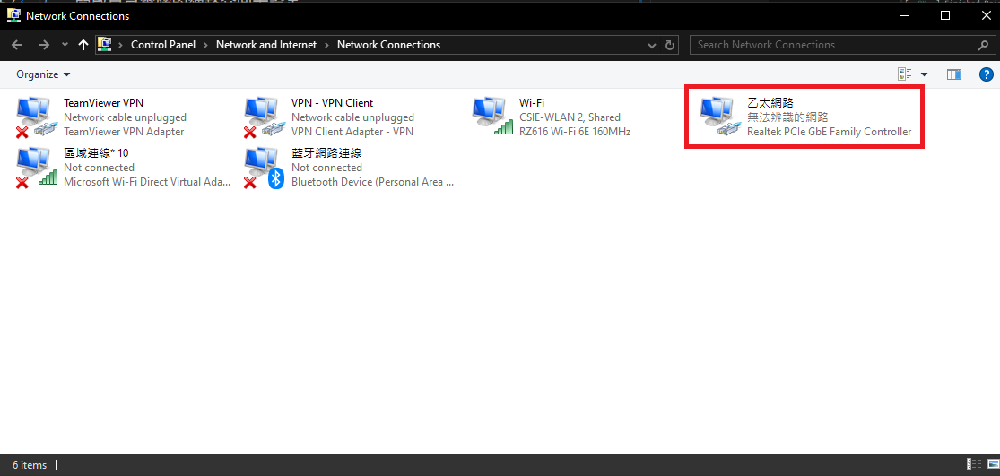
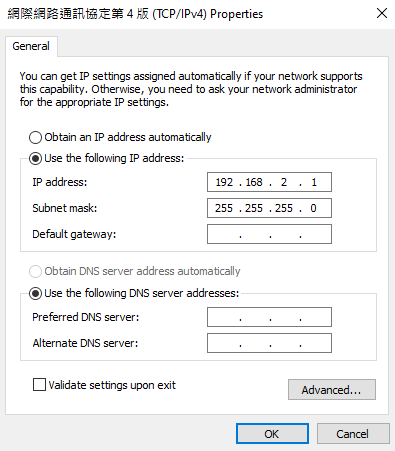
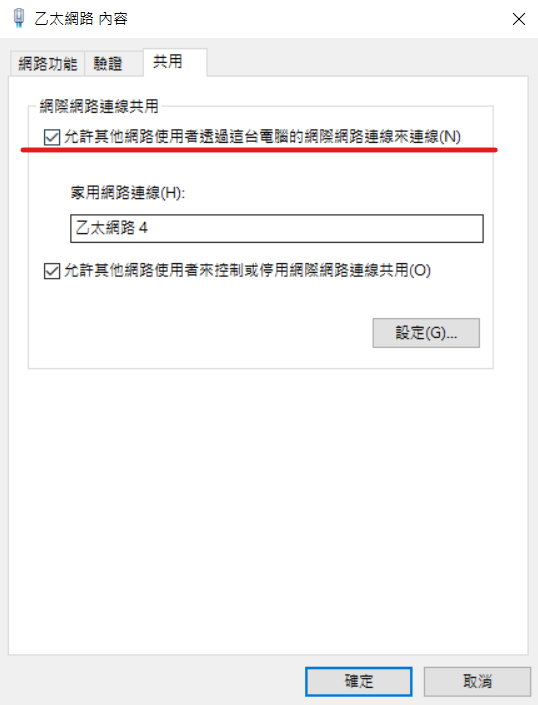
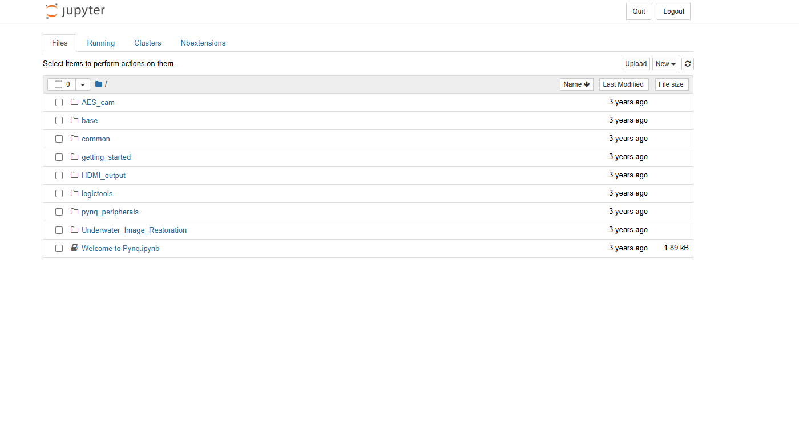

# Part6-PYNQ-Jupyter-Notebook

本章將介紹如何使用 PYNQ 的 Jupyter Notebook 開發環境，透過 Python 與 Overlay ，實現軟硬體協同運作的應用開發流程。使用者可以在網頁介面中，以 Python 程式碼輕鬆控制 PL（Programmable Logic）上的硬體模組，如 GPIO、加減器、影像處理電路等。

## Part 6.1 Flashing PYNQ Image to SD Card

1. 在使用 `PYNQ` 板子前，首先需要將官方提供的映像檔（基於 Ubuntu 的 Linux 系統）燒錄到 microSD 卡中作為作業系統。

2. 下載 PYNQ 所提供的 Ubuntu 系統  

    [PYNQ Ubuntu IMG 下載連結](https://www.pynq.io/boards.html)  

    

3. 下載燒入工具，這邊我們借用 `BalenaEtcher`，當作燒入工具  

    [BalenaEtcher 下載連結](https://etcher.balena.io/)  

    

4. 將下載的 IMG 檔，燒入進 SD 卡當中  

    

    最後按下 Flash 就可以開始燒錄了

## Part 6.2 Booting Up the PYNQ-Z2 Board

1. 將 PYNQ-Z2 的硬體配置依據下圖設置

    

    1. 將開機模式調整至 SD 的位置。

    2. 調整電源供應模式 (使用電源供應器就接 REG；使用 USB 供電就接 USB)。

    3. 插入 micro SD。

    4. 接上電源。

    5. 插上乙太網路線，另一端與筆電連接。
        >若你的電腦是連接路由器有現成的區域網路可以使用，則將 FPGA 與路由器連接，待會跳到 Step2 ver2

    6. 開機  
    開啟電源後先不要動作，等待板子的 RGB LED 閃彩燈後四顆 LED 全亮紅燈/綠燈才代表完全開機完成。

    7. 打開 `MobaXterm` 透過 `Serial`，baud rate 設定 `115200` 連結 FPGA 即可看到 Linux 系統的 terminal 的畫面。

        

2. 查看 PYNQ 的 IP 位置  

    

3. 開啟自己電腦的網路介面卡設定，找到連接到 `PYNQ` 的 `Adapter`

    

4. 將連接到 `PYNQ` 的 `Adapter`，修改 `IPv4` 設定
    - IP 設定成 192.168.2.x 可以設 192.168.2.1 ( 不要跟FPGA板本身的IP位置重複，不要設99 )
    - Subnet mask : 255.255.255.0  

    

5. 如果沒有第2點圖中的 `inet` 可以試試看將該 `Adapter` 的共用選項打勾  

    

6. 設定好後自己電腦的網路介面卡設定後，在 Browser 中輸入  
    - 192.168.2.99 ( FPGA 的 IP ) or pynq:9090

7. 密碼 : xilinx  

    

8. 出現以下畫面就代表成功進入 PYNQ 的 Jupyter Notebook 了

    
