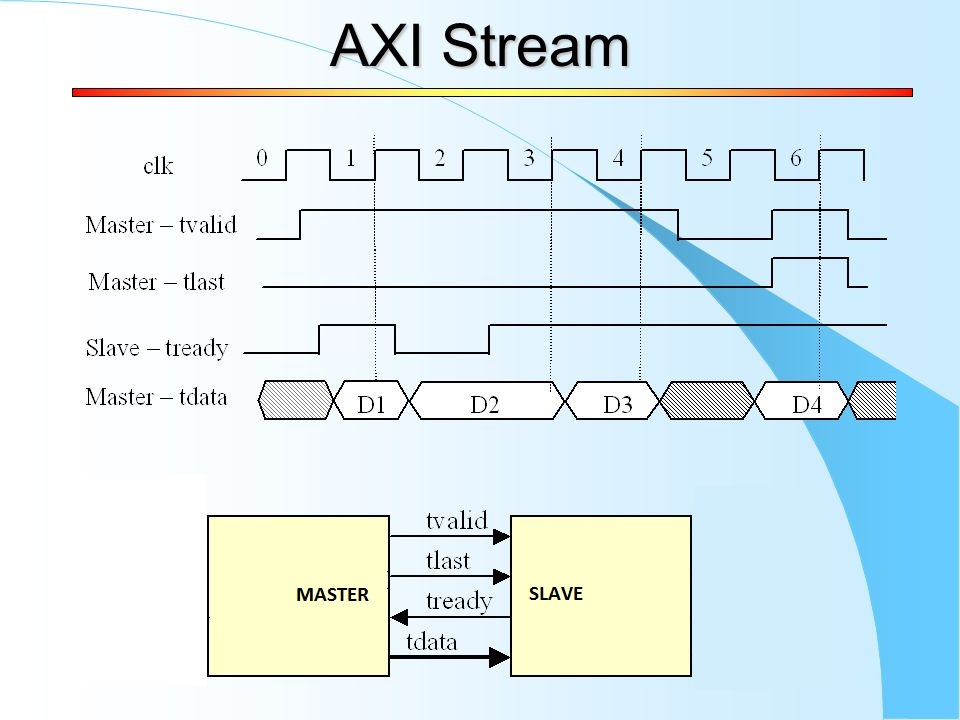

# Part7-DMA

本章將介紹如何在 PYNQ 上使用 **Direct Memory Access (DMA)** 模組實現資料傳輸，並加速 **FFT** 運算。

## Review AXI Stream

### AXI Stream 基本訊號

| 訊號名稱 | 方向 | 功能說明 |
|----------|------|----------|
| `TVALID` | Master ➜ Slave | 傳送端通知接收端資料有效 |
| `TREADY` | Slave ➜ Master | 接收端準備好接收資料 |
| `TDATA`  | Master ➜ Slave | 資料 |
| `TLAST`  | Master ➜ Slave | 表示此資料為最後一筆 |
| `TKEEP`  | Master ➜ Slave | Byte-level 有效位元 Mask |

### Handshake Mechanism

當 `TVALID` 與 `TREADY` 同時為高時，資料才會被傳輸。  
由 `TLAST=1` 來表示「一筆資料傳輸的結束」。  

> 如果接收端突然把 TREADY 從 1 拉成 0，會怎樣？  
>
> - 傳送端仍然會保持 TVALID=1，表示資料還是有效、準備好傳送。
> - 但資料不會實際送出或被接收，因為 TVALID & TREADY ≠ 1。
> - 傳送端會「停住」在當前那筆資料，不會推進到下一筆，直到 TREADY 再次變成 1。

## DMA Module

DMA 在 Xilinx 提供的 IP 當中有分兩種 Mode，分別是 `Scatter Gather Mode (SG Mode)` 和 `Simple Mode`，上圖為 **Simple Mode** 下的 DMA Module。

### Port Description

| 介面名稱         | 功能描述 |
|------------------|----------|
| **S_AXI_LITE**   | 控制介面，連接至 ZYNQ PS 的 **AXI General Port (GP)**（PS端設定 DMA） |
| **S_AXIS_S2MM**  | Stream to Memory-Mapped：輸出資料寫回記憶體 |
| **M_AXIS_MM2S**  | Memory-Mapped to Stream：記憶體資料送入 FFT IP |
| **m_axi_mm2s_aclk** / **m_axi_s2mm_aclk** | DMA Clock 輸入 |
| **axi_resetn**   | Reset 訊號 |
| **introut (mm2s/s2mm)** | Interrupt 訊號，若啟用可連接至 ZYNQ7 PS 的 interrupt 控制器 |

### GP (General Purpose) port vs HP (High Performance) port

| 介面類型 | 名稱 | 資料方向 | 頻寬與用途 |
|---------|------|---------|-----------|
| **GP Port** | `AXI_GP` | PS ➜ PL / PL ➜ PS | 一般用途，低頻寬，**用於設定、控制 IP**（如 AXI Lite） |
| **HP Port** | `AXI_HP` | PL ➜ PS | **高頻寬**，適合 DMA 讀取寫入 DDR 使用 |

## FFT Module

## Part 7.1 Vivado Block Design

1. Create a new Vivado Project and Create a new Block Design
2. 