# Part7-DMA

本章將介紹如何在 PYNQ 上使用 **Direct Memory Access (DMA)** 模組實現資料傳輸，並加速 **FFT** 運算。

## Review AXI Stream

### AXI Stream 基本訊號

| 訊號名稱 | 方向 | 功能說明 |
|----------|------|----------|
| `TVALID` | Master ➜ Slave | 傳送端通知接收端資料有效 |
| `TREADY` | Slave ➜ Master | 接收端準備好接收資料 |
| `TDATA`  | Master ➜ Slave | 資料 |
| `TLAST`  | Master ➜ Slave | 表示此資料為最後一筆 |
| `TKEEP`  | Master ➜ Slave | Byte-level 有效位元 Mask |

### Handshake Mechanism

當 `TVALID` 與 `TREADY` 同時為高時，資料才會被傳輸。  
由 `TLAST=1` 來表示「一筆資料傳輸的結束」。  

> 如果接收端突然把 TREADY 從 1 拉成 0，會怎樣？  
>
> - 傳送端仍然會保持 TVALID=1，表示資料還是有效、準備好傳送。
> - 但資料不會實際送出或被接收，因為 TVALID & TREADY ≠ 1。
> - 傳送端會「停住」在當前那筆資料，不會推進到下一筆，直到 TREADY 再次變成 1。

## DMA Module

DMA 在 Xilinx 提供的 IP 當中有分兩種 Mode，分別是 `Scatter Gather Mode (SG Mode)` 和 `Simple Mode`，上圖為 **Simple Mode** 下的 DMA Module。

### Port Description

| 介面名稱 | 功能描述 | AXI 類型 |
|-------- | -------- | -------- |
| **S_AXI_LITE** | 控制介面，連接至 ZYNQ PS 的 **AXI General Port (GP)**（PS端設定 DMA 的配置用 Register）| **AXI4-Lite**（Slave）|
| **S_AXIS_S2MM** | Stream to Memory-Mapped：輸出資料寫回記憶體 | **AXI4-Stream**（Slave）|
| **M_AXIS_MM2S** | Memory-Mapped to Stream：DMA 從記憶體取資料 | **AXI4-Stream**（Master）|
| **M_AXI_MM2S** | DMA 從 PS 記憶體抓資料送出 | **AXI4 (Memory-Mapped)**（Master）|
| **M_AXI_S2MM** | DMA 將資料寫回 PS 記憶體 | **AXI4 (Memory-Mapped)**（Master）|
| **introut (mm2s/s2mm)** | 傳輸完成的 interrupt 訊號，若使用 interrupt mode 時連接至 ZYNQ PS | — |

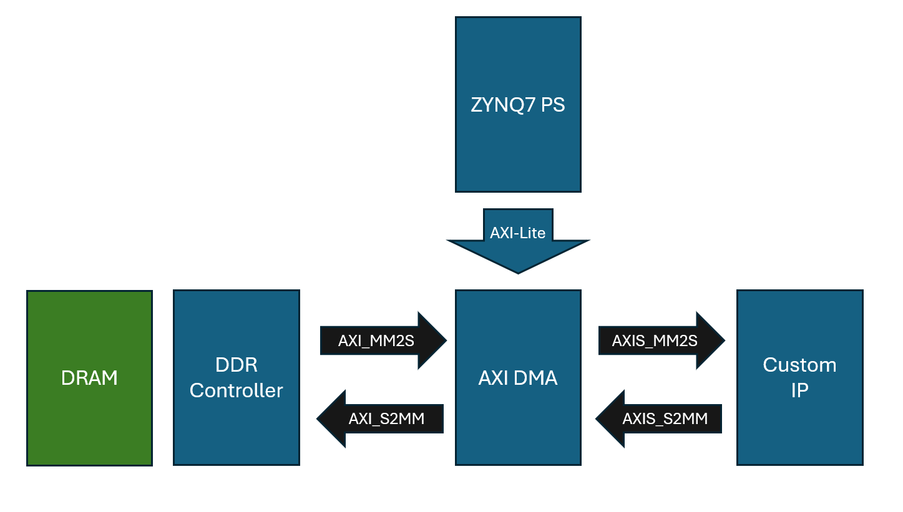
>📌請注意上圖 DDR Controller 實際上是在 ZYNQ7_PS 當中
>
>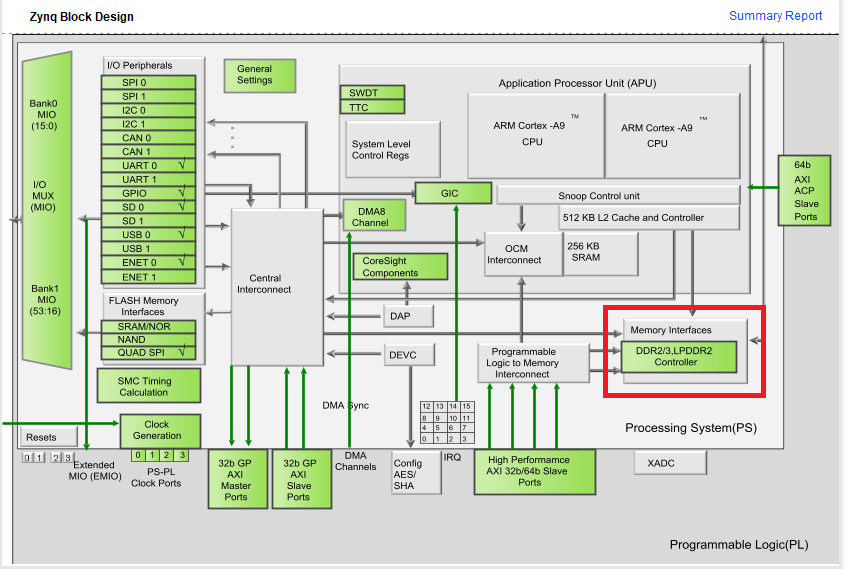

## FFT Module

## Part 7.1 Vivado Block Design

### GP (General Purpose) port vs HP (High Performance) port

| 介面類型 | 名稱 | 資料方向 | 頻寬與用途 |
|---------|------|---------|-----------|
| **GP Port** | `AXI_GP` | PS ➜ PL / PL ➜ PS | 一般用途，低頻寬，**用於設定、控制 IP**（如 AXI Lite） |
| **HP Port** | `AXI_HP` | PL ➜ PS | **高頻寬**，適合 DMA 讀取寫入 DDR 使用 |

1. Create a new Vivado Project and Create a new Block Design
2. 加入 `Zynq7_PS`、`AXI_DMA`、`Fast Fourier Transform`，並且 `Run Block Automation`

    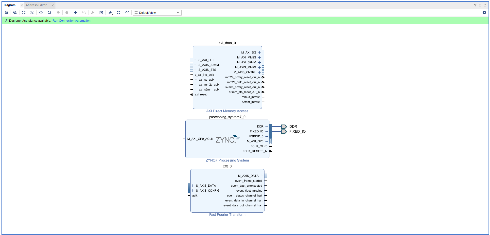

3. 點開 `Zynq7_PS` 的設定介面，`PS-PL Configuration > HP Slave AXI interface > S AXI HP0 interface` 將其打勾並且將 width 設定成 **32bit** (為配合後續FFT IP)

    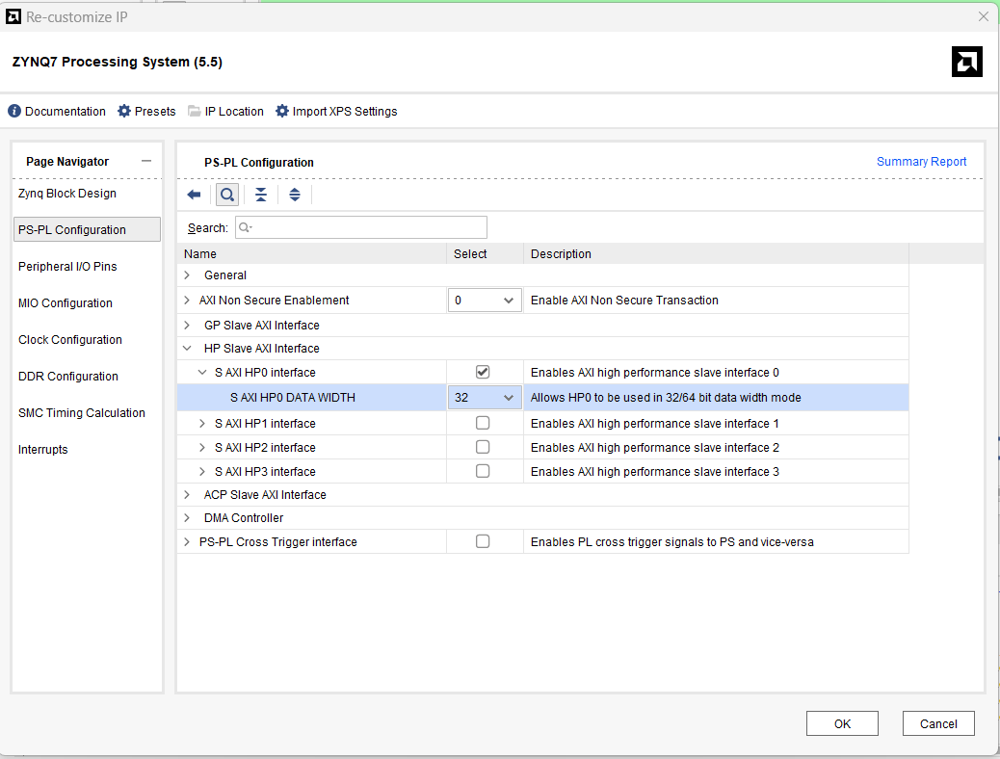

    >📌 為什麼這邊要使用 HP(High Performance Port)?  
    >- AXI DMA 需要將資料寫回 DDR（S2MM）與從 DDR 讀取資料（MM2S）  
    >- GP Port（General Purpose）僅適合控制用途，頻寬低，不適合資料搬移  
    >- HP Port 擁有高頻寬，能與 AXI DMA 配合實現高速傳輸

4. 點開 `AXI_DMA` 取消 `Scatter Gather Engine`，並且 `Width of Buffer Length Register` 設定成 **21bits**

    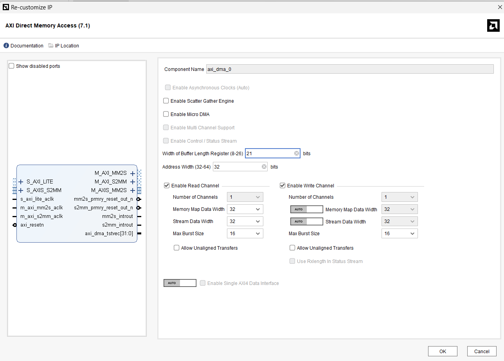

    >📌 Width of Buffer Length Register  
    > 指的是你最多可以指定「一次要傳輸多少筆資料」的數值大小上限。
    >
    > - 長度是以「byte 為單位」來計算
    >
    > - 寬度設 21，代表你最多可以設定的長度為：2^21 = 2,097,152 bytes(= 2MB)
    >
    >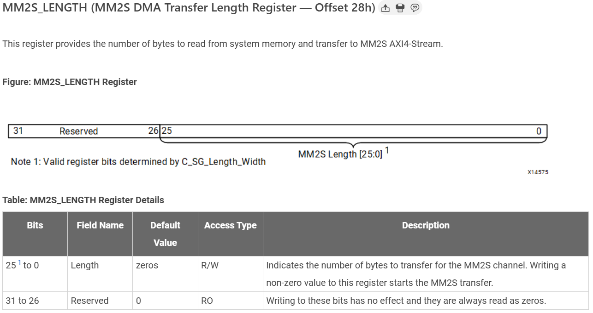
    >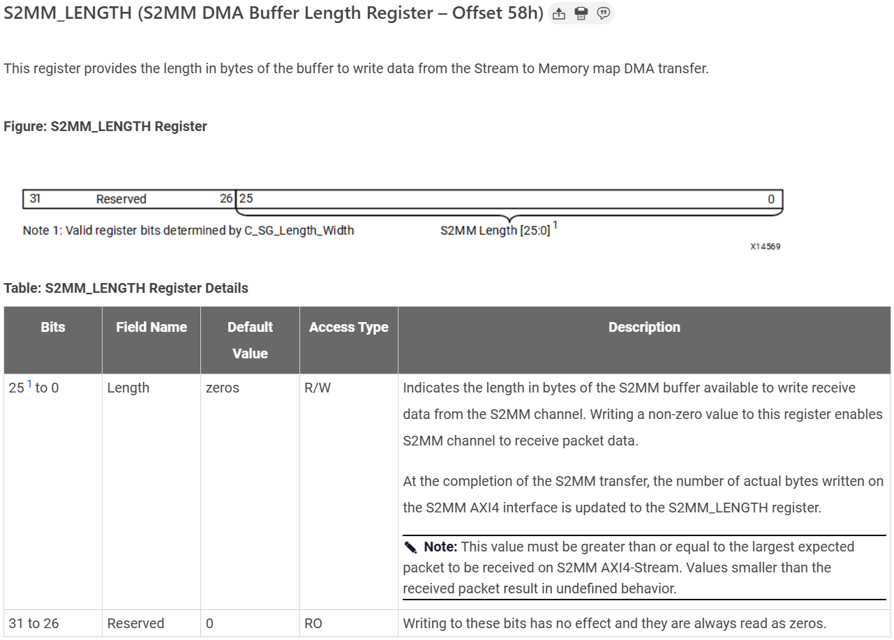

5. 點開 `FFT` 設定  

    - Tramsform Length = 8192 : Transform Length 越大，頻域解析度越高
    - Target Clock Freq = 100
    - Target Data Throughput = 50

    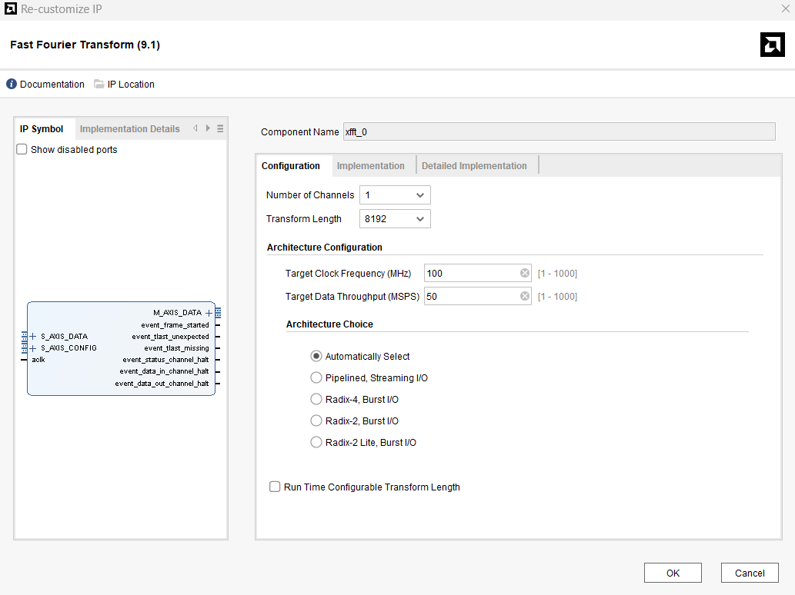

    - Data Format = Fixed Point
    - Output Ordering Options = Natural Order
    - Precision Options/Input Data Width = 16 (實部或虛部的 Width)
    - Precision Options/ Phase Factor Width = 16 (Twiddle Factor 的 Width)

    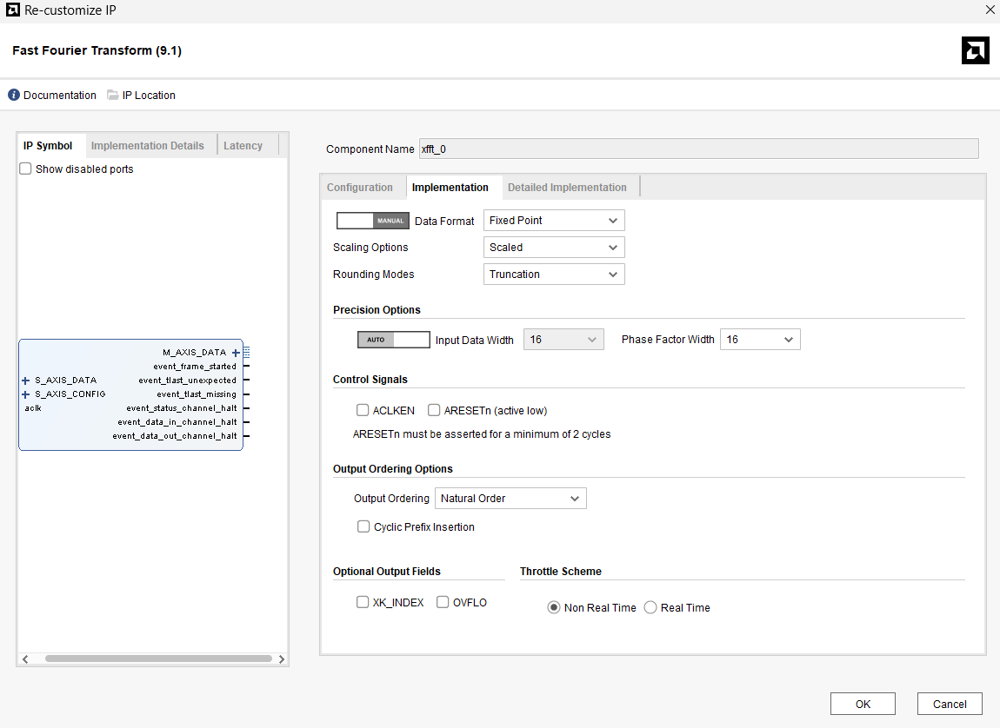

    >📌 上述設定 FFT 所需的資料形式，後續在軟體端需如下設定資料，再輸入進去FFT當中  
    >
    >- Fixed Point = **fix16_15 (Q1.15)**
    >- 16-bit (real) + 16-bit (imaginary) = 32-bit
    >
    >   | bits | 資料內容 |  
    >   | ---- | ------- |
    >   | [31:16] | Imag |
    >   | [15:0] | Real |
    >
    > 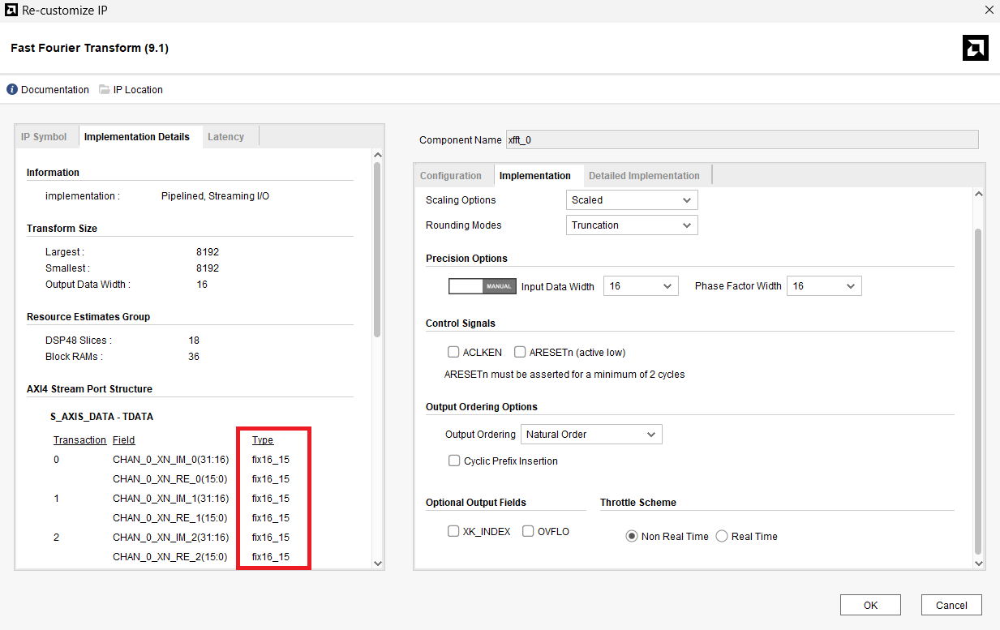

6. 手動接線
    - `DMA:M_AXIS_MM2S -> FFT:S_AXIS_DATA`
    - `FFT:M_AXIS_DATA -> DMA:S_AXIS_S2MM`
    - `DMA:aclk -> ZYNQ7_PS:FCLK_CLK0`

    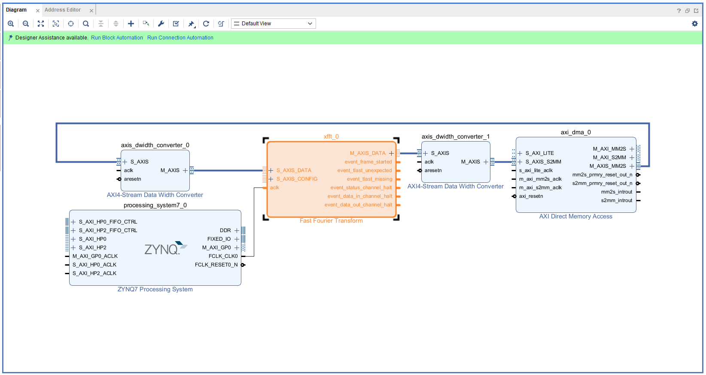

7. `Run Connection Automation 兩次`，最後 Block Design 將如下方所示

    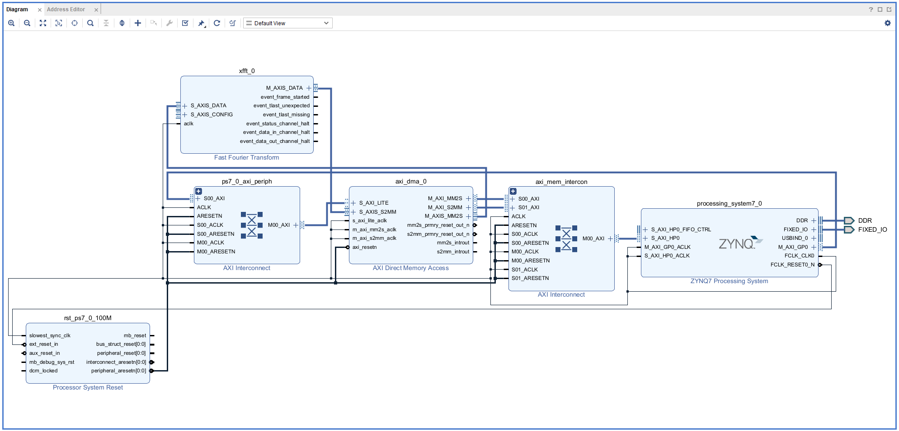

8. Create HDL Wrapper

9. Generate Bitstream 並 Export Hardware Bitstream

## Part 7.2 Jupyter Notebook
