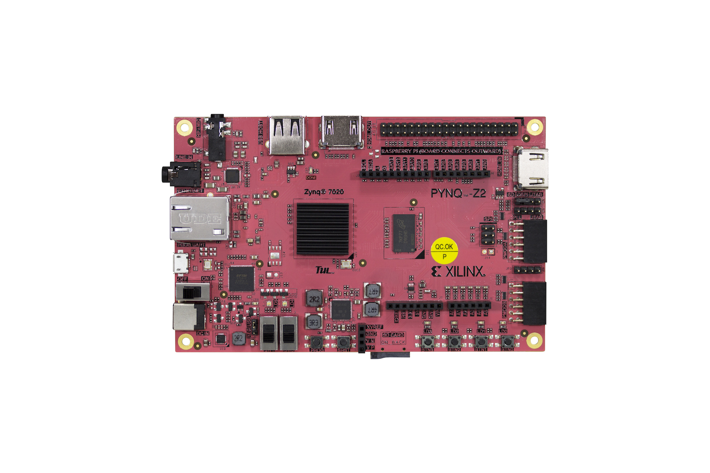

# Xilinx-FPGA-tutorial (未完)
本教學專案目的是協助初學者快速上手 Xilinx 系列 FPGA 和 Vivado 的使用。

## 📘 推薦閱讀順序

1.  [Vivado-Installation-Guide](./Vivado-Installation-Guide/)：Vivado 安裝教學文件  

2.  [Vivado-Tutorial](./Vivado-Tutorial/)：FPGA 基礎開發流程教學  

3.  [Hardware-Software-Codesign](./Hardware-Software-Codesign/)：使用 Vitis 或 PYNQ Python 系統進行軟硬體協同設計的應用實作與控制教學  
  
**FPGA Board**：TUL PYNQ-Z2 / xc7z020clg400-1   

**建議版本**：Vivado 2023.2 、 Vitis 2023.2 / PYNQ 3.0.1  
