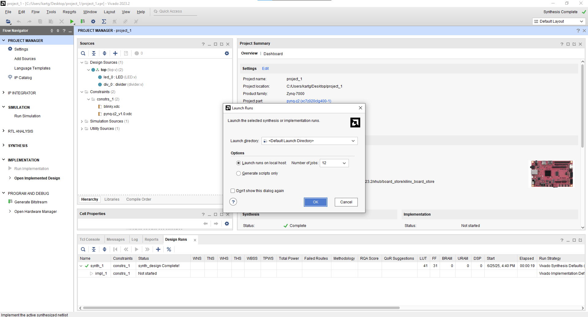
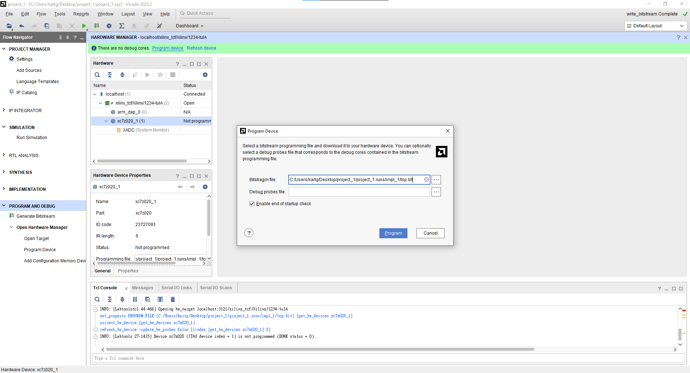

# Part3-FPGA-Design-Flow

Xilinx 的設計流程可以分為以下主要階段：

1.  **RTL 設計撰寫**  
    使用 Verilog/VHDL 撰寫模組，定義功能邏輯。

2.  **Behavior Simulation**  
    透過 Testbench 測試邏輯是否正確。

3.  **Synthesis**  
    將 RTL 轉換為邏輯元件（如 `LUT`、`FF`、`MUX`、`CLB` 等）， 
    並輸出 Netlist，供後續 Implementation 階段使用。  

    > 📌 **Note：FPGA 與 ASIC Synthesis 差異**  
    >  
    > 雖然兩者皆從 RTL（Verilog/VHDL）出發進行合成，但目標資源不同，導致合成結果與工具參數有以下差異：  
    >  
    > - **FPGA Synthesis**：  
    >   - 目標為 FPGA 元件，如 `LUT`、`FF`、`BRAM`、`DSP` 等  
    >   - 使用工具如 Vivado、Quartus  
    >   - 合成結果會映射至 **FPGA** 上面真實存在的實體邏輯資源  
    >  
    > - **ASIC Synthesis**：  
    >   - 目標為 standard cell library，如 AND2_X1、DFF_X1 等  
    >   - 使用工具如 Design Compiler 
    >   - 產出 gate-level netlist 與 SDF 延遲檔，供 Place & Route (P&R) 與 Gate-level simulation 使用  
    

4.  **Implementation**  
    包含 Placement 與 Routing 兩個階段，將合成後的邏輯元件實際配置到 FPGA 的物理資源上，  
    如 CLB、Routing Channel、IO Bank 等。此階段會根據時序需求與佈局限制，進行最佳化配置。  

    > 📌 實務上，Vivado 在 Implementation 階段會執行以下步驟：   
    > - **Place Design**：將邏輯元件放置到 FPGA 上的具體位置（CLB 位置）  
    > - **Route Design**：完成所有訊號間連線並考量時序需求  
    >
    > **Implementation 成功後，Vivado 會執行 Timing Summary 報告，檢查是否滿足時序要求（Setup / Hold）。**

5.  **Generate Bitstream**  
    產生可供下載的 `.bit` 檔，燒錄進 FPGA。

6. **Program & Debug**  
    將 bitstream 寫入 FPGA，並使用 ILA 等工具進行邏輯分析與即時驗證。

## Part 3.1 Add Design Source / Constraint Files
1.  照著 `Part1` 的教學創建一個新的Project

2.  Add or create design sources : 加入 `/RTL` 內的 `top.v` `LED.v` `divider.v`

3.  Add or create constraints : 加入 `/xdc` 內的 `blinky.xdc` `pynq-z2_v1.0.xdc`

4.  若有成功將會呈現如下的 **Hierarchy**  

      

> 📌 **Note: Constraint 是做什麼用的？**  
>
> 在 FPGA 設計中，Constraint 檔案通常使用 `.xdc` 格式，  
> 它的作用是補充 RTL 中無法描述的「物理實作條件」，主要包括：
>
> - **時脈定義（Clock Constraints）**：告訴 Vivado 時脈的頻率與來源，例如 `create_clock`
> - **I/O 腳位綁定（Pin Assignment）**：定義實體腳位對應的 signal，例如將 `clk` 對應到 `W5`
> - **I/O 標準（I/O Standards）**：設定電壓與訊號標準，如 `LVCMOS33`
>
> Constraint 是 **Implementation** 階段中「時序分析、資源配置」的重要依據。  
> 若沒有正確的 `.xdc`，Vivado 可能無法正確進行佈線，或產生有效的 Bitstream。  
>>
>📌 Note: **Constraint Set**  
>Vivado 支援使用 Constraint Set 來管理多組時序與 I/O 限制設定，例如不同的設計階段或測試情境。  
>
>未來在面對大型設計時，可以根據不同模組或需求建立對應的 Constraint Set，方便進行模組化驗證與切換設計條件。
>
> 📌 **延伸補充：Constraint 類似於 ASIC 設計中的 `.sdc` 或 `.sdf`**  
>
> 如果你熟悉 ASIC 流程，Vivado 中的 `.xdc`（Xilinx Design Constraints）在概念上  
> 很類似 Design Compiler 中的 `.sdc`（Synopsys Design Constraints）與 `.sdf`（Standard Delay Format）：
>
> - `.xdc` ≈ `.sdc`：用來定義時脈、I/O 延遲、Pin Mapping 等設計約束  
> - `.xdc` 不等同 `.sdf`，但其 Clock Constraint 可視為 SDF 延遲分析的前置依據  
>
> 在 FPGA 流程中，Vivado 直接根據 `.xdc` 執行時序分析與實體資源配置（Place & Route）。

## Part 3.2 Synthesis
1.  點選左側 **SYNTHESIS → Run Synthesis**，開始進行 RTL 合成流程。

    在彈出的設定視窗中，Vivado 會詢問你希望分配幾條實體執行緒（#Physical Threads）來執行合成。  
    建議依照自己電腦的 CPU 核心數選擇，分配越多執行緒，Synthesis 所需時間通常會越短。  

    

    > 📌 **Synthesis 是在做什麼？**
    >
    > 在 FPGA 設計中，Synthesis 負責將你撰寫的 RTL 程式碼（如 Verilog/VHDL）  
    > 轉換成可由 FPGA 實際執行的邏輯元件，例如：
    >
    > - **LUT（Look-Up Table）**
    > - **Flip-Flop（FF）**
    > - **MUX / Decoder / Carry Chain ....**
    >
    > Synthesis的輸出是一份 **Netlist**，描述模組之間的連接關係，  
    > 這份 Netlist 會提供給下一步的 Implementation 使用。

2.  待合成完成後可以點開左側 **SYNTHESIS -> Open Synthesized Design**

      

    你會發現有非常多種 Report 可供檢視，例如：

    - Report Timing Summary：預估時序是否符合目標頻率

    - Report Utilization：預估使用多少 CLB、LUT、FF 等邏輯資源

    - Report Power：估算功耗

    - Report DRC (Design Rule Check)：檢查邏輯結構是否存在問題

    但要注意：

    >📌 除了資源類（Utilization、Power）比較接近最終值之外，
    大多數 Report（尤其是 Timing 類）都只是基於 Netlist 的預估，
    因為此時尚未經過 Placement 與 Routing，缺乏實體路徑與實際延遲資訊。

3.  點選左側的 `SYNTHESIS -> Open Synthesized Design -> Schematic` 可以看到經過Synthesis後的電路圖  

    

    - **LUT6**（6-input Look-Up Table）  

        

        LUT6 是一種可編程邏輯單元，具有 6 個輸入，可以實現任何 6-input 的布林函數。

        Vivado 會自動將 RTL 中的邏輯運算映射為 LUT。

        LUT 是組成 FPGA 設計邏輯的核心之一。

    - **FDCE**（Flip-Flop with D input, Clock, Clear, Enable）  
    
        
        
        是一種帶有清除（Clear）與使能（Enable）訊號的 D 型正緣觸發器。

        通常用來實作暫存器，儲存狀態或同步資料。  

4.  點選左側上方 **Project Manager** 後跳出的 **Project Summary** 可以看到Utilization的結果，其餘的則要等到 **Implementation** 後才能看到  

    

## Part 3.3 Implementation
1.  點選左側 **IMPLEMENTATION → Run Implementation**  

    

2.  等待實作完成後，點選左側的 **IMPLEMENTATION → Open Implemented Design**  可以看到你的電路實際放到 FPGA 的晶片上面時的擺放位置  

    

3.  **Implementation** 階段 Vivado 會統整出:
    > - **Power Estimation**：預估功耗  
    > - **Timing Analysis**：分析 Setup/Hold Timing 是否滿足設計要求  
    > - **DRC（Design Rule Check）**：檢查佈線、資源使用是否違反設計規則  
    > - **Utilization Report**：彙整資源使用情況（LUT、FF、BRAM 等）  
    > - **Schematic Viewer**：可查看實體配置後的電路圖  

4.  在 **Project Summary** 中可以看到 Implementation 的結果，包含 Timing、Utilization、Power 等資訊  

      

## Part 3.4 Generate Bitstream  

1.  點選左側 **PROGRAM AND DEBUG → Generate Bitstream**

    

2.  Bitstream 生成完後會有如下畫面  

    

## 為什麼要進行 Bitstream Generation？

完成 **Synthesis** 與 **Implementation** 後， Design 已經映射到實體的 FPGA 資源上，但需要透過燒入的方式燒入進去 FPGA 當中，該`.bit`檔案就是所要燒入進去的資源。

**Bitstream Generation** 會將這些設計資訊轉換為 FPGA 可接受的「配置資料」，也就是 `.bit` 或 `.bin` 檔案，主要用途如下：

> 📌 **Bitstream 是用來「Program」FPGA 的**，包含以下資訊：
> - 邏輯元件的對應與連接（from Netlist）
> - Placement & Routing 結果
> - I/O 配置與 Constraint（from .xdc）

下圖為 XC4000 系列的 Fast Carry 硬體架構。  
可以看到圖中 M 代表多工器（MUX），Bitstream 會被用來控制這些 MUX 的選擇路徑，藉此設定每個邏輯元件與連線的實際行為與配置

  

## Part 3.5 Program to FPGA

1.  將 FPGA 與電腦端連接 (將 Micro USB 插上 Port 2)
2.  將8號區的 Jumper 插至 `JTAG` 的位置

    >FPGA 在使用 `JTAG`（Joint Test Action Group）模式下進行配置時，會依據 IEEE 1149.1 標準（又稱為 `Boundary-Scan`）來進行串列資料傳輸。可將我們的 Bitstream 透過 `Boundary-Scan` 的方式燒入進去板子中
    >
    >📌 JTAG 是一種標準的 Debug 與燒錄介面，所有主流 FPGA（如 Xilinx、Intel）皆支援此標準。

3.  打開開關 (3號區) **關機時一定要先關閉開關才可以拔除電源線**

4.  開啟 FPGA 後，回到 Vivado 並點選 `Open Hardware Manager -> Open Target -> Auto Connect`  

    

5.  等待 Vivado 偵測到 xc7z020 ( Pynq-z2 所使用的 FPGA 晶片組) 後按下 `Program device` ，再點選 `Program`

    

6.  燒錄完成後請搭配提供的 RTL Code 觀察 Switch 和 LEDs 的關係

## Additional  

[Extra2-Synthesis-and-Implementation-Strategies](../Extra2-Synthesis-and-Implementation-Strategies/)
