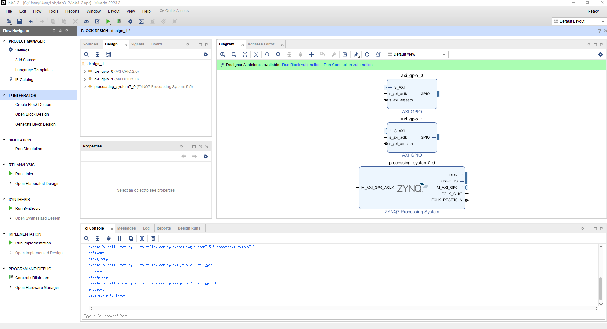
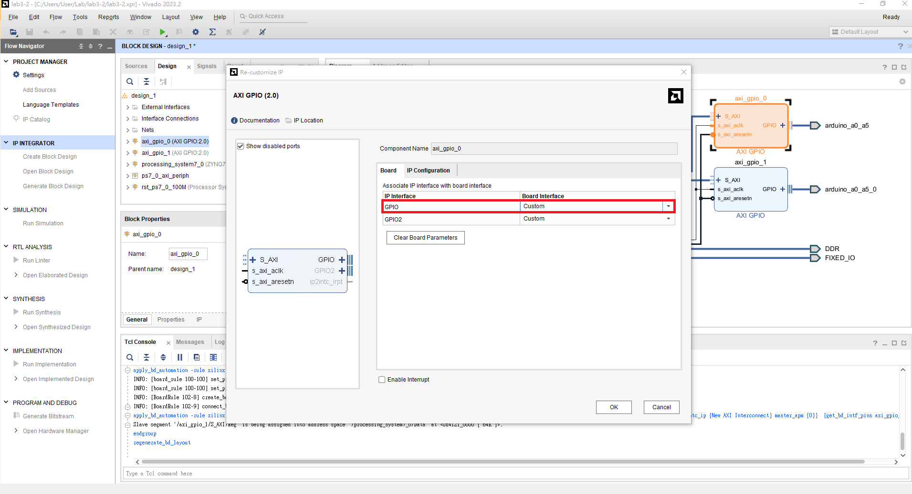
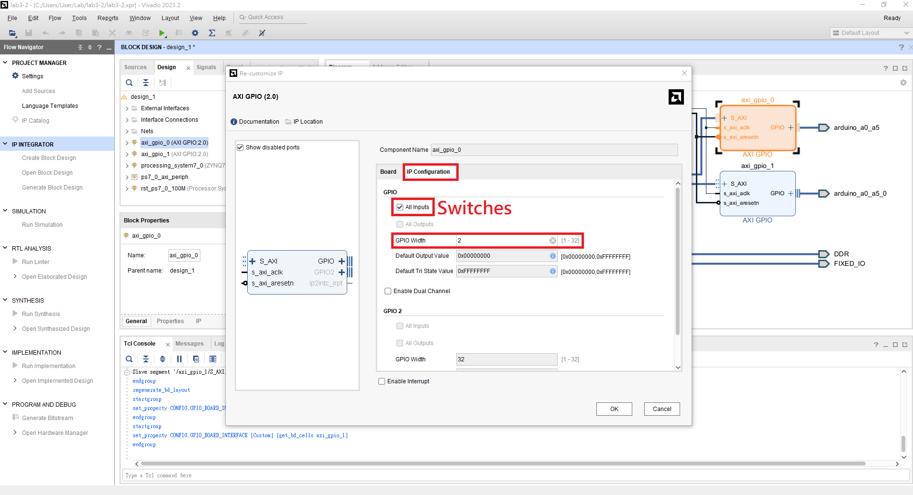
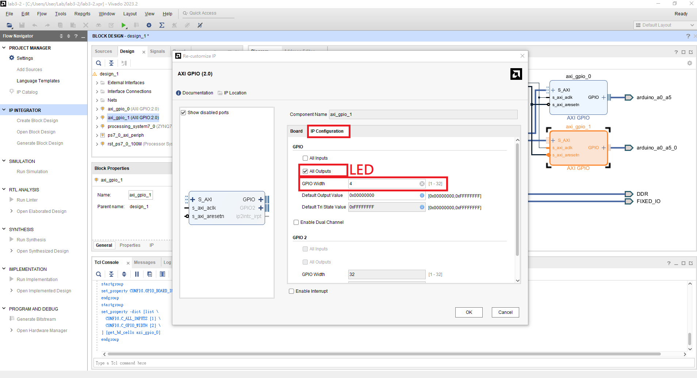
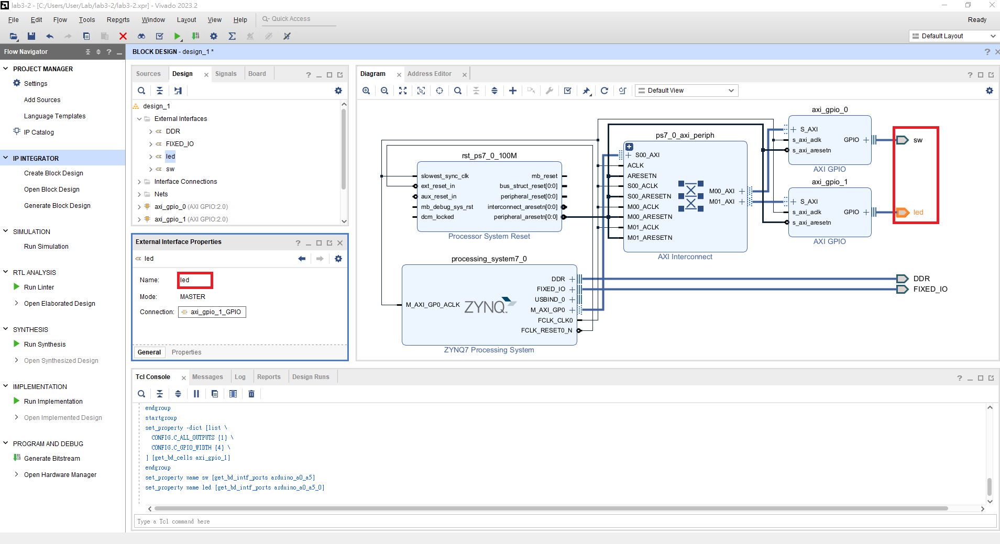
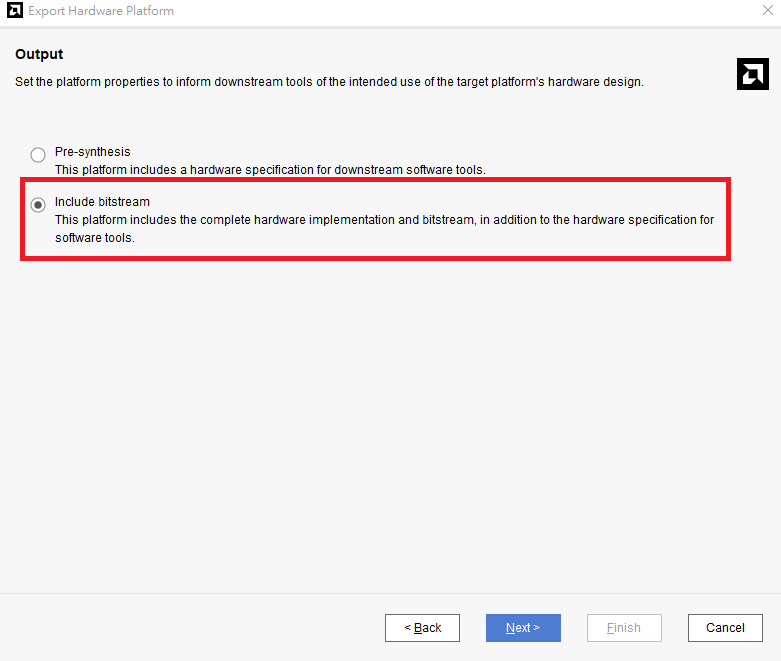
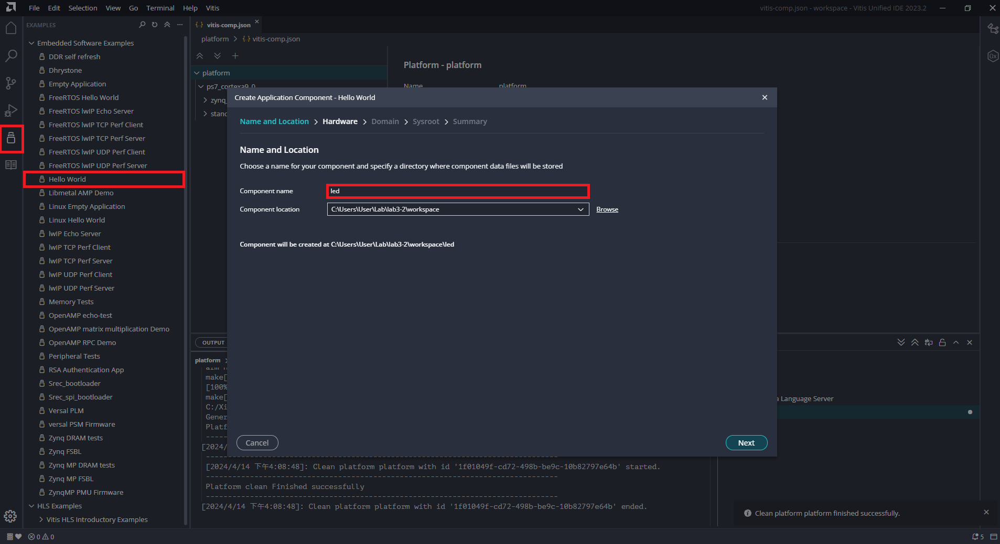

# Part 5-2 AXI-IP

## Introduction to AXI Interface
### AXI Lite

### AXI4

## Simple Implementation with AXI-IP (AXI GPIO IP)
### Step 1. Create a new project
加入 [Constraints](./xdc/pynq-z2_v1.0.xdc)
### Step 2. Create block design
加入三個 IP ```ZYNQ7 Processing System```、```AXI GPIO*2```



Run Block Automation > OK (全部勾選)

Run Connection Automation > OK (全部勾選)

Vivado 會自動幫我們接上 AXI Interconnection 形成下圖。


點開 AXI GPIO IP 將 GPIO 改成 Custom (兩個 AXI GPIO IP 都要改)。


切換到 IP Configuration，分別改成以下兩個設定，兩個 GPIO 一個是接到 LEDs 一個是接到 Switches。




設定完成後，在 External Interface Properties 更改連接出去的 port name，方便辨認。


將完成的 block design 包成 HDL wrapper

### Step 3. Generate bitstream & Export Hardware
File > Export > Export Hardware。
📌 因為 AXI GPIO 是由 programmable logic 執行的所以需產生 bitstream 將 AXI GPIO 燒錄到 FPGA 上。

📌 由於有產生 bitstream 所以 include bitstream 的選項需打勾。


### Step 4. Launch Vitis IDE & Write a LEDs control program
#### Vivado
Tools > Launch Vitis IDE

#### Vitis
Open workspace ，並且 Create Platform Component，選擇前面產生的 XSA 檔案。

利用 Example 建立完整的環境，並選擇前面完成的 platform。


置換 application project 下的 Sources/src/helloworld.c 為 ./src/led.c。

硬體中所有資源都有他所屬的地址，地址要到 platform\export\platform\sw\standalone_ps7_cortexa9_0\include\xparameters.h 查詢。

最後一步，先 build platform 後，再 build application。

連上 PuTTY 後，執行 application 的 Run ，試著調整開關，觀察其結果。

