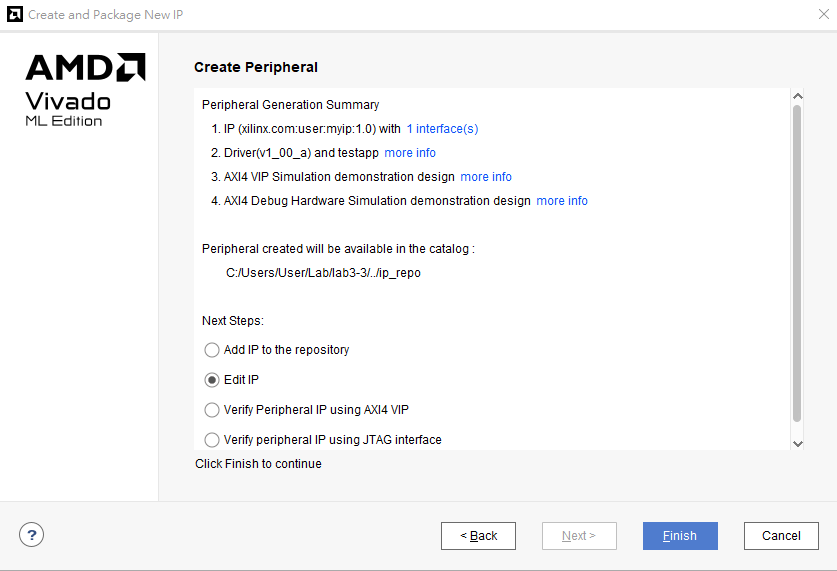
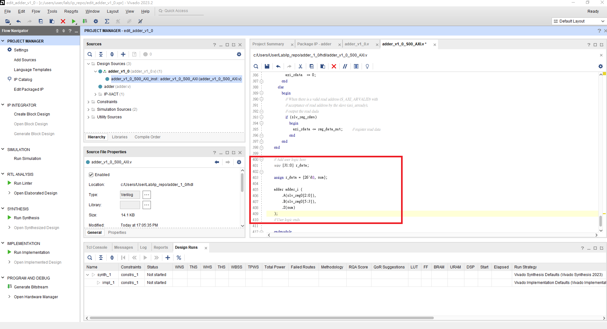
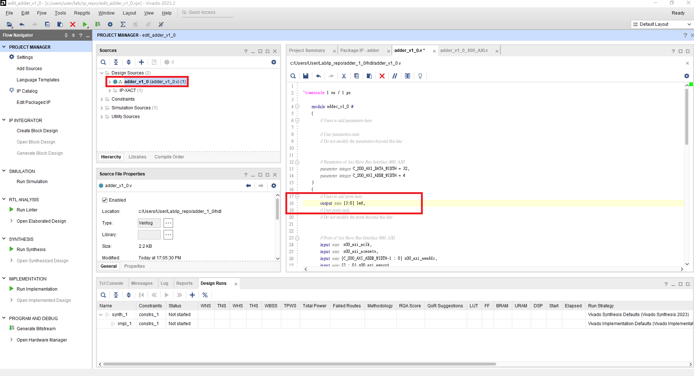
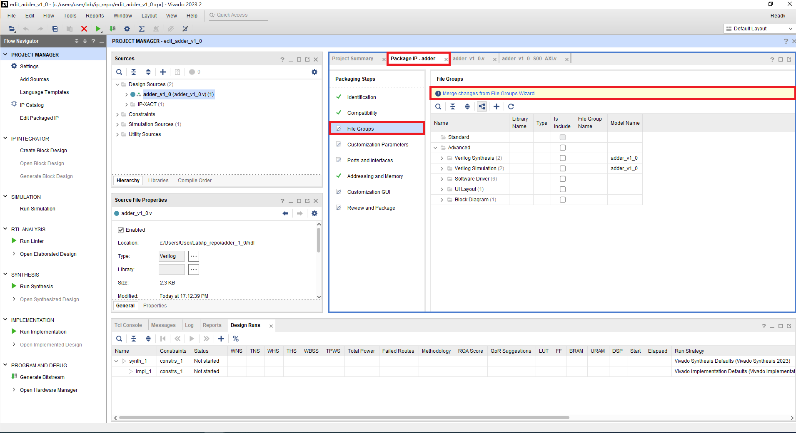
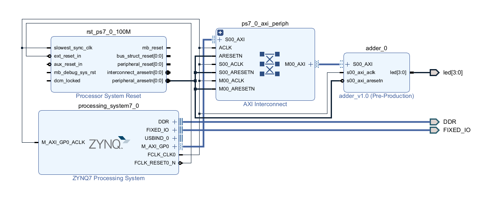
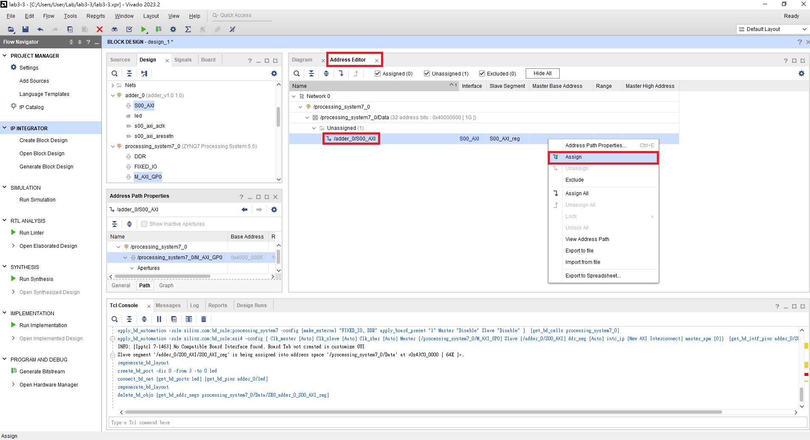
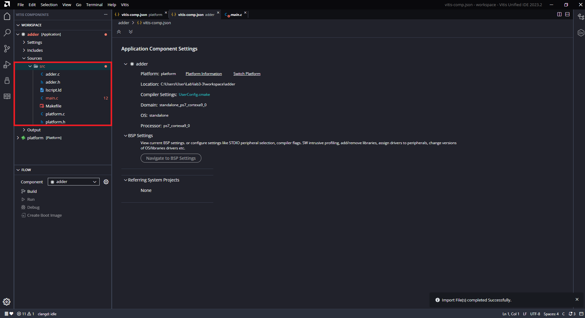
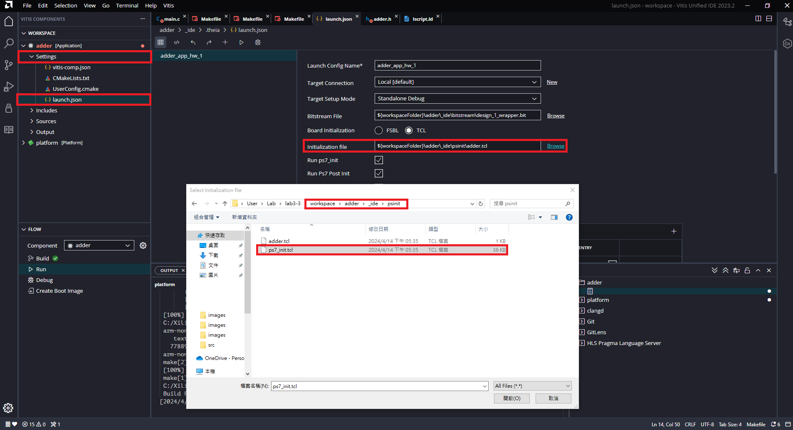

# Part5-3 Custom AXI ip - Package a Custom AXI IP

## Step 1. Create a new project
加入 ```.xcd``` file

## Step 2.
點選 Tools > Create and Package New IP。

接著選擇 Create a new AXI4 peripheral，取名為 adder，最後選擇 Edit IP。




創建完後加入```src/hdl/adder.v```，並修改產生的 HDL code。
> 📌 下面這些步驟主要是在連接 AXI Interface Register 和我們建立的 IP 的 I/O。







HDL code 修改完後，回到 package IP 畫面將沒有打勾的部分點進去修改，最後 Package IP。



回到 create new IP 前的 project，refresh 加入的 IP。


最後的 Block design。


Block design設計完後，到 Address Editor 中設定 AXI 之 base address。(右鍵 -> assign，預設為0X43C0_0000)


## Step 3. Write user IP driver and software program
Create HDL Wrapper 且產生 Bitstream 後，Export Hardware 並開啟 Vitis，建立 Project 加入檔案 ```src/software/main.c```

將 ```src/driver/adder_v1_0/``` 內的程式複製到下圖紅色部分。



並修改 platform 中的三個 makefile:

1. platform/Sources/hw/sdt/drivers/<CustomIP_name>/src/Makefile
2. platform/Sources/ps7_cortex_a9_0/standalone_domain/bsp/hw_artifacts/drivers/<CustomIP_name>/src/Makefile
3. platform/Sources/zynq_fsbl/zynq_fsbl_bsp/hw_artifacts/<CustomIP_name>/src/Makefile

將makefile中的 ```OUTS = *.o``` 修改為 ```OUTS=$(addsuffix .o, $(basename $(wildcard *.c)))```

除此之外，Vitis需要的是ps7_init.tcl，然而自製 ip 也有屬於自己的 tcl，因此需要到 ```Settings\launch.json``` 的 ```Initialization file``` 修正



