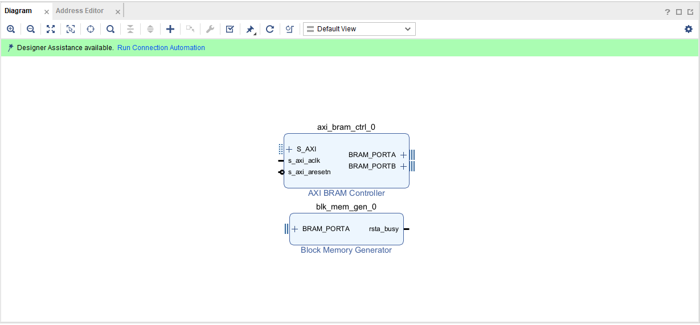
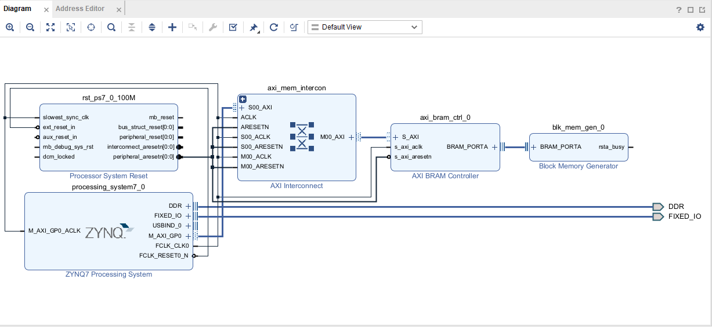
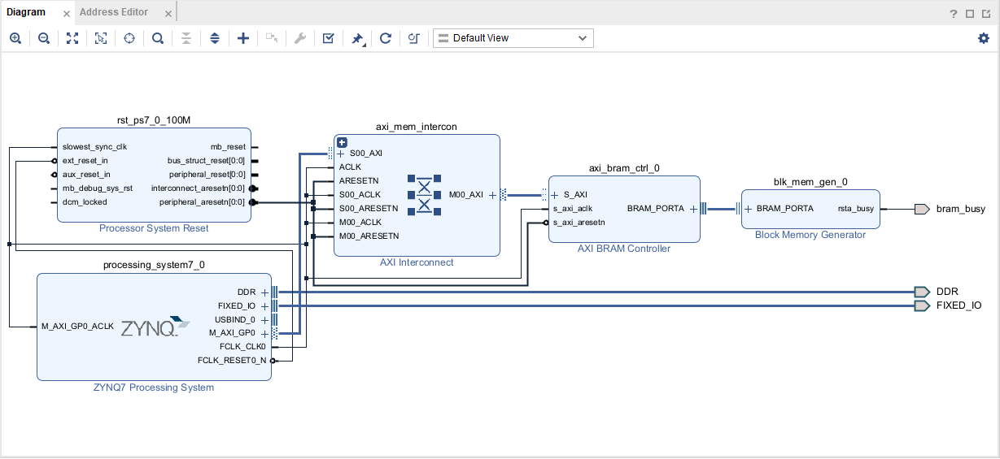
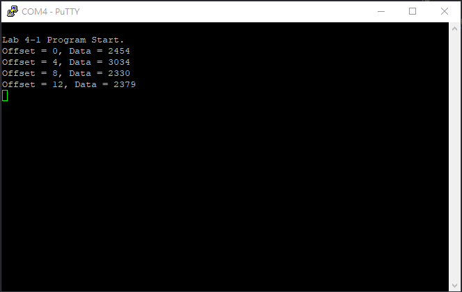

# Part 6-1 BRAM Generator

## Purpose
使用圖形化介面，透過 Block Memory Generator IP 來呼叫 Block RAM。

## Block Design
建立專案後 Create Block Design，並加入 Block Memory Generator、AXI BRAM Controller兩個 IP。

在 `AXI BRAM Controller` 的圖示左鍵點擊兩下，進入調整 IP 的介面，並依照下圖調整。

完成後再加入 Zynq Processor 的IP，並執行 `Block Automation`、`Connection Automation`，完成後的 Block Design 應該會如下圖。

圖中 `Block Memory Generator` 的 Output Port 是 Block RAM 的 busy 訊號，我們再加上一個 Output Port 連接到 LED 來觀察 BRAM 的運作。

接著加入 `xdc/pynq-z2_v1.0.xdc`；將 Block Design 轉換成 HDL Wrapper 後 Generate Bitstream。

完成後打開 Project Summary 的 Utilization Table 可以看到 BRAM 的 Utilization。

接著建立 Vitis 的 C code Project，加入 `src/main.c` 到 Project 中並執行。

