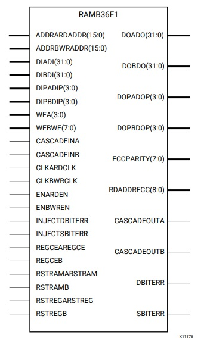

# How to Utilize Embedded Block RAM on FPGA

## Purpose
學習透過不同方式呼叫 PYNQ-Z2 上內建的 Block RAM - RAMB36E1

## Block RAM
Block RAM can be configured as :

- FIFOs
- 2 independent 18Kb blocks or a single 36Kb block RAM
- Simple Dual Port (SDP) / True Dual Port (TDP) are supported
